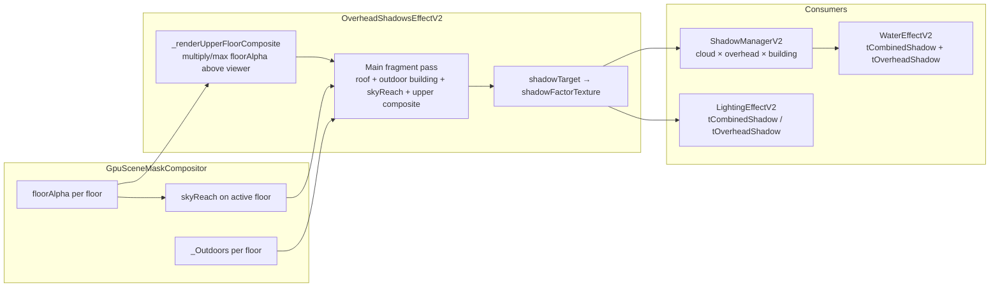

# Multi-floor shadow cascade (design + debugging)

This note explains how Map Shine Advanced ties **upper-floor masks** into **Overhead Shadows V2**, why results can still look “broken” after RT-size fixes, and what a **real shadow cascade** would add later.

## Current pipeline (as implemented)

Upper-floor shelter and bridge-style shadows are not a separate engine feature; they are extra **terms inside `OverheadShadowsEffectV2`**, driven by `GpuSceneMaskCompositor` masks in **scene / world UV** (same space as `_Outdoors`).



**Semantics**

- `shadowTarget` encodes **lit factor** in RGB: `1 = fully lit`, `0 = fully shadowed` (see shader comment “Encode shadow factor…”).
- `ShadowManagerV2` treats `tOverheadShadow` the same way: it multiplies RGB by alpha (tile-projection slot) and converts to a scalar lit factor before combining with cloud and building shadows.

**Important limitation:** The **upper-floor tile shadow** path only sees floors **strictly above** the active floor index (`_collectUpperFloorFloorAlphaTextures`). A deck and a river drawn as **the same floor band** do not produce an “upper” `floorAlpha` for that relationship; those cases must rely on **roof capture**, **tile projection**, or a future cascade that reasons about geometry within a band.

---

## Fixes already landed (context)

1. **Upper-floor composite RT size** — GPU `floorAlpha` textures may not expose DOM-style `image.width` / `height`. The compositor now tries `image`, `source.data`, and `texture.width` / `height`, and falls back to:
   - `GpuSceneMaskCompositor.getOutputDims('floorAlpha')`, then
   - `renderer.getDrawingBufferSize` if everything else still looks like `2×2`.

2. **Sky-reach sampling** — shelter was sampled at unprojected mask UV; it now follows the same sun-offset path as the upper-floor composite (`maskOffsetUvUpperTile`) and shares `upperTileEdgeFade` to reduce edge streaking.

3. **Uniform refresh** — `OverheadShadowsEffectV2.update()` must not early-return in a way that skips Tweakpane-driven uniform uploads.

If behavior is still wrong after that, the problem is usually **data or classification**, not the slider wiring.

---

## Checklist: what else can block visible shadows?

### 1. No upper-floor textures in practice

Symptoms: upper-floor composite stays white / unused; only sky-reach or roof terms could show.

Verify:

- `MapShine.floorStack.getFloors()` includes bands **above** the active floor (`index` greater than active).
- For each upper band, `GpuSceneMaskCompositor.getFloorTexture(key, 'floorAlpha')` is non-null.
- Keys match: `compositorKey` string **or** `"${elevationMin}:${elevationMax}"` must match `_floorCache` keys (see `getFloorTexture` in `GpuSceneMaskCompositor.js`).

Upper floors that only exist as **cache-only preload** and never go through a full `composeFloor` may never publish GPU `floorAlpha`.

### 2. Active floor `skyReach` missing or wrong

Sky-reach shelter reads `getFloorTexture(activeKey, 'skyReach')`. If that RT is null, `uHasSkyReach` stays off and the sky-reach term never runs.

Sky-reach is **derived** from upper `floorAlpha` unions in the mask pipeline (`skyReachShader.js` / compositor). If upstream `floorAlpha` never built for upper bands, sky-reach on the receiver floor will not encode the bridge deck.

### 3. `receiverIsOutdoors` zeros the term

Roof/sky-reach/upper-floor **mask** contributions are multiplied by outdoor receiver classification. Pixels classified as **indoor** on `_Outdoors` get **zero** from those paths by design.

If water or ground under the bridge is tagged indoor (or the mask is wrong at that UV), sliders will “do nothing” visually for those pixels.

**Debug:** In Overhead Shadows, set **Debug View** to show `receiverOutdoors` (mode `1`) and `roofCombinedStrength` (mode `5`) / `skyReachShelterAvg` (mode `7`) — see uniform `uDebugView` in `OverheadShadowsEffectV2.js`.

### 4. Effect or manager opacity

- `OverheadShadowsEffectV2.params.enabled` must be true and the effect must pass `resolveEffectEnabled` for your graphics preset.
- `ShadowManagerV2.params.overheadOpacity` — if driven to `0`, the combined shadow map ignores overhead.
- `LightingEffectV2.params.overheadShadowAmbientInfluence` — scales overhead on **ambient** only; very low values can make overhead subtle depending on scene lighting.

### 5. Strict sync hold

If `MapShine.renderStrictSyncEnabled === true` and `_validateFrameInputs()` fails, `FloorCompositor.render()` can return early **before** overhead / lighting passes. Check `MapShine.__v2StrictHoldInfo` when the scene “freezes” or skips updates.

### 6. Multi-floor water vs composite shadow

When `tCombinedShadow` is bound, water **murk / foam** use the **combined** lit factor so cloud + overhead + building are not double-applied. If combined is white (1) everywhere, water stays bright regardless of individual passes — trace `ShadowManagerV2.render` and inputs from `_runShadowManagerCombinePass`.

### 7. Same-band geometry

If the bridge deck and the river share the **same floor index**, the “upper-floor `floorAlpha` composite” path has nothing to stack **above** the viewer. You need either:

- a **higher** floor band in the stack for the deck, or
- **roof / tile-projection** capture that sees the deck from the viewed level, or
- a future **in-band cascade** (below).

---

## Console probes (quick)

Use helpers from `scripts/utils/console-helpers.js` if available in your build, or manually:

```js
const comp = MapShine?.sceneComposer?._sceneMaskCompositor;
const floors = MapShine?.floorStack?.getFloors?.() ?? [];
const active = MapShine?.floorStack?.getActiveFloor?.();
floors.map(f => ({
  idx: f.index,
  key: f.compositorKey,
  floorAlpha: comp?.getFloorTexture?.(String(f.compositorKey ?? `${f.elevationMin}:${f.elevationMax}`), 'floorAlpha'),
}));
comp?.getFloorTexture?.(String(active?.compositorKey ?? '0:10'), 'skyReach');
```

Confirm non-null textures and plausible dimensions (not `2×2`).

---

## Toward a real “multi-floor shadow cascade”

What exists today is a **2D mask projection**: sun direction offsets samples in mask UV, plus blurs. A **cascade** in the usual rendering sense would add:

1. **Per-band depth or height fields** — not only albedo alpha, but a representation of “how high” each surface is relative to the ground band, so one floor can shadow another **without** requiring a higher entry in `floorStack`.

2. **Layered shadow RTs** — e.g. one RT per elevation band (or N cascades split by distance), each storing **occluder height / coverage** from the sun’s POV, then compositing **downward** onto lower bands before the final lit-factor multiply.

3. **Stable temporal filtering** — when masks update asynchronously with tile loads, cascades need clear rules for **hold vs flash** (similar to strict sync, but per-band).

4. **Single contract for lit factor** — keep the `ShadowManagerV2` convention: **R = lit**, `1` = no darkening, so lighting, water, and particles stay consistent.

5. **Authoring rules** — document when mappers must split bridge vs water into **separate floor bands** vs when in-band cascade is required.

Implementation would likely touch `GpuSceneMaskCompositor` (new passes or RTs), `FloorCompositor` (ordering / per-level bind), and possibly a slimmed **height-aware** variant of the overhead shader — not only `OverheadShadowsEffectV2` parameters.

---

## File map

| Area | File |
|------|------|
| Upper-floor `floorAlpha` collection + composite | `scripts/compositor-v2/effects/OverheadShadowsEffectV2.js` |
| Mask definitions / `floorAlpha`, `skyReach` | `scripts/masks/GpuSceneMaskCompositor.js`, `scripts/masks/shaders/skyReachShader.js` |
| Combine cloud + overhead + building | `scripts/compositor-v2/effects/ShadowManagerV2.js` |
| Frame order, strict sync, bind combined shadow | `scripts/compositor-v2/FloorCompositor.js` |
| Water sampling combined vs legacy | `scripts/compositor-v2/effects/water-shader.js`, `WaterEffectV2.js` |

---

## Related docs

- `FLOOR_RENDER_PIPELINE_AUDIT.md` — broader V2 level merge and water placement.
- `scripts/compositor-v2/VALIDATION-REGISTRY.md` — strict validation behavior.
