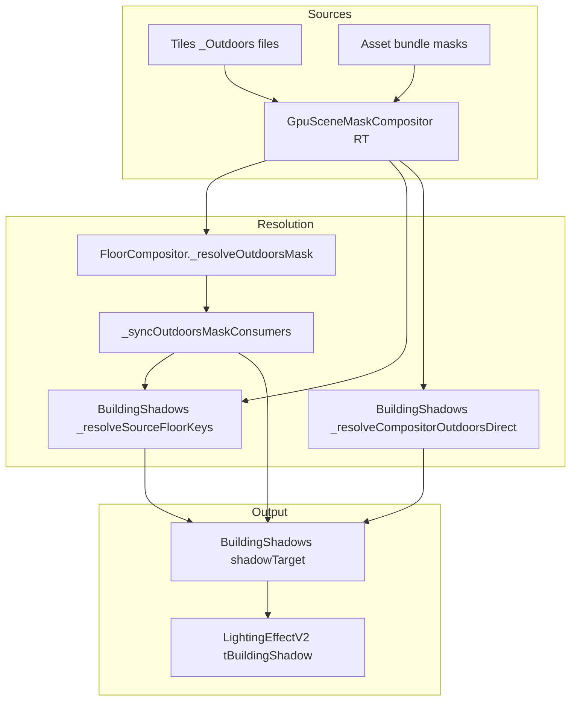

# Plan: Building shadows vs _Outdoors (current state)

**Status:** investigation / planning only  
**Last updated:** 2026-04-01  
**Context:** Foundry VTT 13.x, Map Shine module; scene example from health export (“Mythica Machina - Town River Bridge”, `moduleVersion` `0.1.9.18` at time of capture).

---

## 1. User-reported reality (ground truth)

| Observation | Notes |
|---------------|--------|
| **Specular “works”** | Visually acceptable; user reports it has behaved this way for a long time. |
| **Building shadows do not work** | Primary bug from the user’s perspective. |

**Implication:** Any health rule that flags specular `_Outdoors` binding while specular still looks correct is **orthogonal or misleading** for this bug. Fixing or silencing specular diagnostics does not prove building shadows are fixed.

---

## 2. What the health JSON actually says (2026-04-01 sample)

Relevant excerpts from the supplied export:

### 2.1 Overall

- `overallStatus`: `degraded`
- `activeFloorOverallStatus`: `degraded`
- `activeFloorKey`: `floor:0`
- `runtime.levelContextKey`: `0:20`
- `runtime.visibleFloors`: `[0]` (single visible floor)

### 2.2 BuildingShadowsEffectV2

- **Status:** `healthy`
- **Checks:** only `updateHeartbeat` → `pass` (update count ~2258, last update age ~14–16 ms)

**Gap:** There is **no behavioral contract** in this snapshot that asserts:

- an `_Outdoors` mask is bound for building shadows,
- `getFloorTexture(..., 'outdoors')` succeeds for the keys the effect uses,
- the shadow RT has non-degenerate content, or
- `LightingEffectV2` is sampling the expected texture.

So **“healthy” here means “the effect’s `update()` ran recently,”** not “building shadows are correct in the final image.”

### 2.3 SpecularEffectV2 (distractor for this bug)

- **Status:** `degraded`, marked **root cause** in the effect list
- **Failure:** `specularOutdoorsBinding` — single-floor, `roofMaskEnabled: 0`, `weatherRoofMapUuid` / `specularRoofMapUuid` null, `singleFloorRoofSource` null

**User correction:** Specular still **looks** fine. Possible explanations (to validate in code, not assumed):

1. Shader path treats “no roof map” as full-outdoor or neutral for the visible content.
2. Other terms (stripes, wet, etc.) dominate perception.
3. Health captures a different frame or uniform state than what the eye judges.
4. Module build at `0.1.9.18` does not include newer specular bind logic; user perception is from an older consistent behavior.

Regardless: **root-cause tagging on specular should not block prioritizing building shadows.**

### 2.4 GpuSceneMaskCompositor

- **Status:** `healthy`
- **Check:** `activeFloorOutdoorsResolvable` → `skipped`, message **“Condition not active”**

**Gap:** On **single-floor** (or certain visibility) paths, compositor-specific outdoors resolvability may **not run**, so the export gives **no direct signal** whether `getFloorTexture('0:20', 'outdoors')` (or sibling keys) is populated—exactly the kind of data building shadows need.

---

## 3. Intended pipeline (from code intent)

`BuildingShadowsEffectV2` (see `scripts/compositor-v2/effects/BuildingShadowsEffectV2.js`):

1. Uses **dark regions of the _Outdoors mask** (indoors / building footprint) as a basis for a **directional projected shadow field**.
2. Renders into **scene-space** RTs (`_strengthTarget`, then `shadowTarget`), sized to match mask/scene space—not necessarily screen size.
3. Exposes a factor texture consumed by **`LightingEffectV2`** (graph edge: required).

**FloorCompositor** sync path (conceptual):

- Resolves `_Outdoors` and pushes it to consumers including `_buildingShadowEffect.setOutdoorsMask(...)`.
- If that sync is null, stale, or keyed wrong, building shadows can fail **while other effects still appear fine** (different bind paths, fallbacks, or shader semantics).

---

## 4. Problem statement (precise)

We need to determine **which link is broken**:

1. **Asset / load:** `_Outdoors` never loads for this scene or band.
2. **Compositor:** GPU scene mask never produces an `outdoors` RT/texture for the floor key the building-shadow pass uses (`0:20` vs internal `_floorMeta` keys, sibling keys, timing).
3. **Sync:** `FloorCompositor._syncOutdoorsMaskConsumers` does not populate `_outdoorsMask` when building shadows need it, or overwrites with null.
4. **Effect logic:** `BuildingShadowsEffectV2` resolves **empty `floorKeys`**, misses **fallback** `_resolveCompositorOutdoorsDirect`, or clears RT to white when it should draw.
5. **Downstream:** `LightingEffectV2` does not sample `shadowFactorTexture` / wrong UV space / wrong pass order (less likely if “never worked” consistently—still verify).

Until one of these is proven, “building shadows don’t work” is **under-instrumented** relative to specular.

---

## 5. Hypotheses (ordered for investigation)

| ID | Hypothesis | Why it fits the snapshot |
|----|------------|---------------------------|
| H1 | **Key mismatch** — active compositor key `0:20` does not match `_floorMeta` / cache keys; `getFloorTexture` returns null for every resolved key; fallback path also misses. | Specular health shows null roof map; compositor outdoors check skipped. |
| H2 | **Single-band compose never ran or is stale** — outdoors RT not built for one-floor maps until a specific warmup (historical issue area for `GpuSceneMaskCompositor`). | Single visible floor; user previously hit single-band compose gaps. |
| H3 | **`_outdoorsMask` sync race** — `setOutdoorsMask(null)` or late bind; building shadow render runs with white/black cleared target. | BSE can fall back to direct compositor read; order matters. |
| H4 | **Mask semantics** — `_Outdoors` loads but is **uniform** (e.g. all outdoor), so projection produces **no visible indoor shadow**. | Would look like “broken” but health might still look “fine” if only heartbeat exists. |
| H5 | **Lighting compose ignores or mis-scales** building shadow factor. | BSE “works” in isolation but final image unchanged. |

---

## 6. Investigation plan (concrete steps)

### Phase A — Prove data at the building-shadow boundary (no code assumptions)

1. **Breaker Box / export:** Capture `outdoorsTrace` (full health JSON) on the **same** scene and note:
   - `consumers.buildingShadows._outdoorsMaskSync`
   - `gpuCompositor.getFloorTextureAttempts` for keys including `0:20`, `0:20` siblings, `ground`
   - `gpuCompositor.floorMetaByKey` / `floorCacheGpuOutdoors` rows
2. **Runtime probe (temporary or console):** For one frame, log in or right after `BuildingShadowsEffectV2.render`:
   - `floorKeys` from `_resolveSourceFloorKeys`
   - whether **fallback** `_resolveCompositorOutdoorsDirect` returned a texture
   - `drewAny` after the render loop (already structured in code paths)

### Phase B — Narrow to one failure bucket

- If **no mask anywhere** → asset / manifest / tile GPU compose (upstream).
- If **mask exists in compositor but `_outdoorsMask` null** → `FloorCompositor._syncOutdoorsMaskConsumers` and call order vs `render()`.
- If **mask bound but RT always cleared / white** → shader or receiver mask path in BSE.
- If **RT looks correct in debug blit but lighting unchanged** → `LightingEffectV2` wiring and UV.

### Phase C — Health / Breaker Box improvements (so this class of bug is visible)

1. **BuildingShadowsEffectV2:** Add behavioral checks (not only heartbeat), e.g.:
   - `outdoorsMaskResolvable` when `params.enabled` and compositor present
   - `shadowTargetNonTrivial` (optional, gated—expensive) or last-frame **boolean** “drewAny” from diagnostics
2. **GpuSceneMaskCompositor:** Ensure `activeFloorOutdoorsResolvable` (or equivalent) **runs on single-floor** when building shadows or specular depend on it, or add a dedicated `singleFloorOutdoorsResolvable` rule.
3. **Root-cause propagation:** Do not mark **SpecularEffectV2** as graph root cause when the user’s failure mode is **building shadows** unless specular is proven upstream of the mask failure.

---

## 7. Files to treat as primary (implementation touchpoints)

| Area | File(s) |
|------|---------|
| Building shadow pass | `scripts/compositor-v2/effects/BuildingShadowsEffectV2.js` |
| Outdoors sync to consumers | `scripts/compositor-v2/FloorCompositor.js` (`_syncOutdoorsMaskConsumers`, `_resolveOutdoorsMask`) |
| GPU mask RTs | `scripts/masks/GpuSceneMaskCompositor.js` |
| Lighting consumer | `scripts/compositor-v2/effects/LightingEffectV2.js` (uniforms sampling building shadow factor) |
| Diagnostics | `scripts/core/diagnostics/HealthEvaluatorService.js`, Breaker Box UI |

---

## 8. Success criteria

1. On the reported scene, **building shadows visibly respond** to `_Outdoors` (indoor areas receive directional shadowing consistent with sun direction).
2. Health export shows a **failing** building-shadow contract if the mask or draw path is broken—not only a passing heartbeat.
3. Specular health may still warn separately, but **does not** mask or replace building-shadow signal.

---

## 9. Open questions

- Does the scene’s `_Outdoors` file actually contain **interior** dark regions, or is it mostly open sky / uniform “outdoor”? (Affects H4.)
- After upgrading past `0.1.9.18`, does specular health still report `roofMaskEnabled: 0`? (Version skew vs user perception.)
- Is **Levels** active with a band `0:20` that does not match how `FloorStack` assigns `compositorKey`?

---

## 10. Reference snapshot (meta only)

From user-provided JSON (abbreviated):

```json
{
  "meta": {
    "moduleVersion": "0.1.9.18",
    "sceneName": "Mythica Machina - Town River Bridge",
    "activeFloorOverallStatus": "degraded"
  },
  "runtime": {
    "levelContextKey": "0:20",
    "visibleFloors": [0]
  }
}
```

Building shadows: `healthy` with **updateHeartbeat only**.  
Specular: `degraded` with **specularOutdoorsBinding**.  
GpuSceneMaskCompositor: **activeFloorOutdoorsResolvable skipped**.

---

## 11. Codebase research — everywhere `_Outdoors` / `outdoors` matters

Canonical mask id in code is the string **`outdoors`** (lowercase). User-facing / file suffix naming is **`_Outdoors`**. Effects query the compositor with `getFloorTexture(floorKey, 'outdoors')` and the tile cache with `Map` key `'outdoors'`.

### 11.1 Consumer / producer inventory

| Role | Location | How it gets `outdoors` |
|------|----------|-------------------------|
| **GPU compose + cache** | `scripts/masks/GpuSceneMaskCompositor.js` | `compose()` / `composeFloor()` build `_floorCache` RTs and merge into `_floorMeta.masks`. `getFloorTexture` prefers **GPU RT**, then **meta file texture**. |
| **Central sync** | `scripts/compositor-v2/FloorCompositor.js` | `_resolveOutdoorsMask()` then `_syncOutdoorsMaskConsumers()` → `setOutdoorsMask` on cloud, water, sky, filter, fog, **overhead**, **building shadows**; `weatherController.setRoofMap`; cloud per-floor path uses `getFloorTexture` per visible floor. |
| **Building shadows** | `scripts/compositor-v2/effects/BuildingShadowsEffectV2.js` | `_outdoorsMask` from sync; render uses `_resolveSourceFloorKeys` + `getFloorTexture(key,'outdoors')`; fallback `_resolveCompositorOutdoorsDirect`; receiver uses `_resolveReceiverMaskTexture`. |
| **Specular** | `scripts/compositor-v2/effects/SpecularEffectV2.js` | Per-floor: `_resolveOutdoorsTextureForFloorWithMeta` (**sibling key** scan). Single-floor: weather `roofMap` then compositor / bundle / maskManager / registry fallbacks. |
| **Overhead shadows** | `scripts/compositor-v2/effects/OverheadShadowsEffectV2.js` | Compositor `getFloorTexture` + `this.outdoorsMask`; also registry / bundle subscription paths. |
| **Water / Sky / Cloud / Filter / Fog** | respective `*EffectV2.js` | `setOutdoorsMask` from FloorCompositor (water has special floor-aware outdoors for fallback). |
| **Weather (roof map)** | `scripts/core/WeatherController.js` | `connectToRegistry` subscribes to `'outdoors'`; `FloorCompositor` also `setRoofMap` with resolved texture. Used by legacy / specular paths, **not** the same field as `BuildingShadowsEffectV2._outdoorsMask`. |
| **Distortion** | `scripts/compositor-v2/effects/DistortionManager.js` | `getGroundFloorMaskTexture('outdoors')` only. |
| **Particles (CPU)** | `SmellyFliesEffect.js`, `DustMotesEffect.js` | `getCpuPixels('outdoors')` / bundle `masks.find(…)`. |
| **Diagnostics** | `HealthEvaluatorService.js`, Breaker Box | `outdoorsTrace`, `specularOutdoorsBinding`, `activeFloorOutdoorsResolvable`. |
| **Manifest / flags** | `scripts/settings/mask-manifest-flags.js` | Enabled id set always includes `outdoors` with `specular` (recent change). |
| **Scene composer** | `scripts/scene/composer.js` | `keyMasks` includes `'specular', 'outdoors'`. |
| **Lighting (final)** | `scripts/compositor-v2/effects/LightingEffectV2.js` | Samples **`tBuildingShadow`** in **scene UV** (`sceneUvFoundry`) — must match scene-space building-shadow RT. Separate optional `outdoorsMaskTexture` for roof-light path. |

### 11.2 Frame order (verified)

In `FloorCompositor.render` (approximate):

1. `_syncOutdoorsMaskConsumers({ context: activeLevelContext })` runs **early** each frame (after lazy populate / floor context correction).
2. `update()` runs for effects including `_buildingShadowEffect.update`.
3. **Stage `buildingShadows`:** `_buildingShadowEffect.render(...)`.
4. **Stage `lighting`:** `_lightingEffect.render(..., buildingShadowTex, …)` where `buildingShadowTex` is `shadowFactorTexture` when enabled.

So **sync → BSE render → lighting** is consistent; a null outdoors at BSE render time is not an ordering bug vs sync—it means **resolution** failed, not **late** sync.

---

## 12. Inconsistency catalog (actionable)

These are **documented divergences** that can explain “things don’t connect” without an obvious single bug.

### I1 — Health: compositor outdoors rule **disabled** on single-floor

`HealthEvaluatorService` registers `activeFloorOutdoorsResolvable` with:

```js
when: (_inst, ctx) => {
  const floors = window.MapShine?.floorStack?.getFloors?.() ?? [];
  return floors.length > 1;
},
```

So when `floorStack` reports **one band** (the user’s case: `visibleFloors: [0]`), the rule **never runs** → export shows “Condition not active” while building shadows still depend on `getFloorTexture(..., 'outdoors')`. **Diagnostics are structurally blind** for the failing scenario.

### I2 — **Sibling-key resolution**: specular vs building shadows vs FloorCompositor

- **SpecularEffectV2** (`_resolveOutdoorsTextureForFloorWithMeta`): if `compositorKey` and `bottom:top` fail, it scans **`_floorMeta` + `_floorCache` keys** sharing the same **band bottom** and tries `getFloorTexture` until one hits.
- **BuildingShadowsEffectV2** `_resolveCompositorOutdoorsDirect`: only **active compositorKey → levelContext `b:t` → `_activeFloorKey` → `getGroundFloorMaskTexture`** — **no** sibling-key walk.
- **FloorCompositor `_resolveOutdoorsMask`**: tries a **deduped list** of context key, active compositor key, internal active key — **no** sibling-key walk (same gap as BSE direct fallback).

If the only populated cache key is e.g. `0:100` while the stack reports `compositorKey` `0:20`, **specular’s multi-floor path could succeed** while **BSE + FC resolution keep missing** until `cachedEntries` fallback in `_resolveSourceFloorKeys` kicks in (see I3).

### I3 — Building shadows `floorKeys`: `pushKey` requires a live texture

`_resolveSourceFloorKeys` only adds a key if `compositor.getFloorTexture(key, 'outdoors')` is truthy (`pushKey`). If **every** candidate key misses initially, the list stays empty until:

- retry with `activeKey` from level context,
- or **`cachedEntries`** (all `_floorMeta` keys that **already** have a texture),
- or `pushKey('ground')` when `floors.length <= 1` or active index ≤ 0.

So BSE has a **second-chance** path via `cachedEntries`, but it depends on `_floorMeta` iteration and prior successful `getFloorTexture` for those keys. If meta exists but RT empty and file texture missing, **no entry** in `cachedEntries`.

### I4 — `getGroundFloorMaskTexture` vs `getFloorTexture`

- **`getFloorTexture`**: `_floorCache` GPU RT **first**, then `_floorMeta` mask list.
- **`getGroundFloorMaskTexture`**: picks lowest band bottom key in **`_floorMeta`** only, then **`getMaskTextureForFloor`** — which reads **`meta.masks` only**, not `_floorCache`.

After a normal `composeFloor`, GPU outputs are **merged into** `newMasks` stored in `_floorMeta`, so the **same** `THREE.Texture` often appears in both. If meta is **seeded** without GPU merge (preload seed path) or meta/cache **diverge**, ground fallback can return **null** while a key-specific `getFloorTexture` might still work—or the opposite, depending on eviction/state. This is a **footgun** for “use ground” fallbacks (BSE direct, FC `_resolveOutdoorsMask`, DistortionManager).

### I5 — GPU `compose()` outdoors inclusion vs registry

In `GpuSceneMaskCompositor.compose`, mask types are collected from tiles, then for **Levels** contexts:

```js
if (ctx != null && finite bottom/top) {
  if (registry?.outdoors) allMaskTypes.add('outdoors');
}
```

So **`registry.outdoors` slot** can force outdoors into the compose set even with no tile-drawn outdoors (commented rationale: refresh/drop stale RT). If registry wiring were wrong, behavior would differ from tile-only discovery. (Tiles still add their own keys from `entry.masks.keys()`.)

### I6 — `composeFloor` **requires Levels**

`composeFloor` returns **`null`** when `!isLevelsEnabledForScene(sc)`. Non-Levels scenes rely on **other** bundle/CPU paths; building shadows still assume compositor + keys—**another** split brain if scene flags and user expectations disagree.

### I7 — Building-shadow **preload warmup** only when `floorCount > 1`

`_maybeWarmFloorMaskCache` returns immediately if `floorCount <= 1`. Multi-floor scenes get background `preloadAllFloors`; **single-floor** scenes do **not** get this nudge from BSE. If outdoors RT depends on preload side effects for some scenes, single-band maps are disadvantaged.

### I8 — **Two parallel “roof / outdoors” feeds**

- **WeatherController.roofMap** — updated by registry subscription + `FloorCompositor._syncOutdoorsMaskConsumers` `setRoofMap`.
- **BuildingShadowsEffectV2._outdoorsMask** — only `setOutdoorsMask` from FloorCompositor; render also hits compositor directly.

Specular (single-floor) historically preferred **`roofMap`** first. Building shadows **do not** read `roofMap`. So **weather roof map can be non-null while BSE still has null sync + null compositor key**—effects disagree on “what outdoors is.”

### I9 — Comments vs code: “EffectMaskRegistry removed”

`scripts/foundry/canvas-replacement.js` contains comments that **EffectMaskRegistry** was removed / GpuSceneMaskCompositor is the real system, but many modules still call `window.MapShine?.effectMaskRegistry?.getMask?.('outdoors')` and `compose` uses `getEffectMaskRegistry()`. This is **confusing for debugging** and may indicate **partial migration** (some code paths stale, some active).

### I10 — Mask object shape checks differ slightly

Across files, lookups use `m.id === 'outdoors' || m.type === 'outdoors'` vs `(m?.id ?? m?.type) === 'outdoors'`. Usually equivalent; if an asset ever sets **only** `id` or **only** `type` with different casing, edge cases differ.

### I11 — “No draw” → white shadow target → lighting = **no visible building shadow**

When BSE cannot draw any floor pass, it clears the shadow target to **white**. In `LightingEffectV2`, high `tBuildingShadow.r` → **lit** (see `mix(1.0, bldShadow, opacity)`). So **missing mask reads as “fully lit”** — same user symptom as “building shadows don’t work,” with **no health failure**.

---

## 13. Likely failure graph (from research, not proven)



Break any **thick** edge (wrong key, null texture, white RT) and the user sees no building shadows while other effects may still look acceptable.

---

## 14. Recommended next code moves (from research)

1. **Unify resolution**: reuse one helper (sibling-key + same key order as `FloorCompositor._resolveOutdoorsMask`) for **BSE `_resolveCompositorOutdoorsDirect`** and optionally **FC** so specular / BSE / FC cannot disagree.
2. **Health**: add `activeFloorOutdoorsResolvable` **when `floors.length <= 1`** OR rename to `outdoorsResolvableForActiveView` with a single-floor branch using `getFloorTexture` probes + `outdoorsTrace` data.
3. **BSE diagnostics**: expose last-frame `{ floorKeys, fallbackTexHit, drewAny, receiverMaskSource }` for Breaker Box (mirrors specular `_healthDiagnostics` depth).
4. **Audit** `getGroundFloorMaskTexture` vs `getFloorTexture` after cache eviction / preload seed — consider making ground fallback call **`getFloorTexture(groundKey, …)`** instead of meta-only `getMaskTextureForFloor` if RT is authoritative.

---

*Sections 11–14 added from static codebase review (grep + file reads). Update when runtime traces confirm which inconsistency bites the reported scene.*

---

## 15. Cross-map differential findings (working vs broken)

User provided back-to-back runtime snapshots using the same console probe on two maps:

- **Working map:** `Mythica Machina - Wizards Lair / Laboratory`
- **Broken map:** `Mythica Machina - Town River Bridge`

### 15.1 High-signal diffs

| Field | Working map | Broken map | Interpretation |
|---|---|---|---|
| `sceneComposerBundle.maskIds` | `["specular","fire","outdoors","bush","tree"]` | `["specular"]` | Broken map bundle has no `outdoors` asset entry. |
| `sceneComposerBundle.outdoorsInBundle` | `true` | `false` | Unified resolver can succeed on working map via bundle route, cannot on broken map. |
| `unifiedResolver.route` | `"bundle"` | `null` | Confirms no compositor key hit and no bundle fallback on broken map. |
| `compositor.metaKeyCount` | `1` (`"0:10"`) | `0` | Broken map has no per-floor meta cache populated for outdoors-compatible floor masks. |
| `compositor.activeFloorKey` | `"0:10"` | `null` | Broken map compositor active floor was not established at capture time. |
| `runtime.activeLevelContext` vs floor key | `0:10` == `0:10` | `20:20` vs `0:10` | Broken map has context/key mismatch (Levels context disagrees with floor stack/compositor keying). |

### 15.2 Important control observation

In **both** captures, `buildingShadows.present` is `false`.

This means the snapshots were taken at a moment where `window.MapShine.floorCompositor.buildingShadowsEffect` was not instantiated/attached, so these captures isolate upstream `_Outdoors` availability but do not directly prove BSE pass internals for that frame.  
Still, the upstream differential is clear and sufficient to explain why broken-map `_Outdoors` resolution fails.

### 15.3 Why shadows from the working map can appear on the broken map

User observation: *building shadows visible on broken map appear to be from the working map*.

Most likely mechanism:

1. Working map renders a valid building-shadow texture path.
2. On map switch, broken map fails `_Outdoors` resolution (`route: null`, no bundle outdoors, no compositor floor cache/meta).
3. If BSE/lighting path does not fully invalidate or replace the prior texture in all code paths for the new scene, stale previous-scene shadow content can remain visible.

This aligns with existing inconsistency notes around cache/state divergence and null-resolution paths (see I3, I4, I11), and is consistent with the broken map showing **no current outdoors source**.

### 15.4 Updated confidence on hypotheses

- **H1 (key mismatch):** stronger support (`20:20` vs `0:10`).
- **H2 (single-band compose/cache gap):** stronger support (`metaKeyCount: 0`, `activeFloorKey: null`).
- **H3 (sync/init timing/state):** still plausible, especially given `buildingShadows.present: false` at probe time.
- **H4 (uniform mask semantics):** less likely for broken map; there is no outdoors mask to evaluate.
- **H5 (lighting ignores):** now lower priority vs upstream source failure + possible stale texture carry-over.

### 15.5 Immediate debugging priority from these findings

1. Ensure broken map has a valid `outdoors` source (bundle and/or compositor floor cache entry) before BSE render.
2. Fix/guard map-switch invalidation so previous-scene building-shadow textures cannot leak when current scene has no valid outdoors source.
3. Normalize level-context keying for single-floor maps so `activeLevelContext` and floor/compositor keys agree (`20:20` vs `0:10` mismatch).
