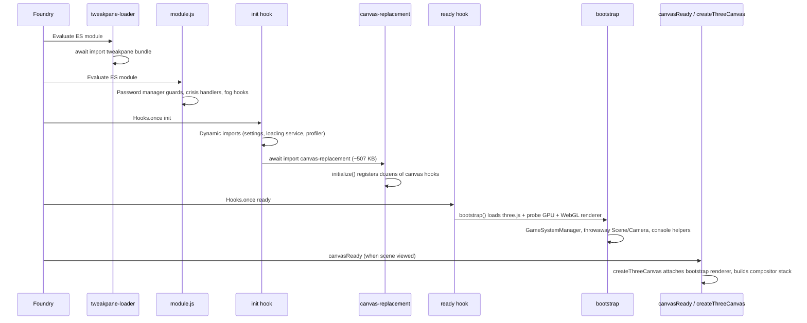

# Module Loading Investigation

**Date:** 2026-06-16  
**Scope:** Read-only audit starting at `scripts/module.js` and tracing outward through Foundry hooks, bootstrap, and canvas initialization.  
**Module version at time of audit:** 0.5.0.2 (`module.json`)  
**Foundry target:** v14 (`module.json` compatibility)

**Document parts:** Part 1 (load timeline) · Part 2 (removal candidates) · Part 3 (expanded codebase sweep)

---

## Executive summary

Map Shine Advanced has grown into a multi-phase loader with several distinct layers (ES module evaluation → `init` → `ready` → `canvasReady` → `createThreeCanvas`). Much of the architecture is intentional and defensive (race handling, lazy bootstrap, load coordinators, overlay safety nets). However, the investigation found **clear dead code, stale documentation, duplicated work, and at least one high-impact unused import** that likely pulls hundreds of kilobytes of JavaScript into the `init` hook for no runtime benefit.

The most actionable finding: **`canvas-replacement.js` is imported during `init` and statically imports `ParticleSystem`, which is never referenced in that file.** That single unused import transitively loads `WeatherParticles.js` (~465 KB), `EffectComposer.js`, `WeatherController.js`, and Quarks — before the user has even opened a scene.

---

## How Foundry loads the module

### `module.json` entry order

```json
"esmodules": [
  "scripts/vendor/tweakpane-loader.js",
  "scripts/module.js"
],
"scripts": [
  "scripts/lib/lib.js"
]
```

| Asset | Role | Notes |
|-------|------|-------|
| `tweakpane-loader.js` | First ES module | Top-level `await import('./tweakpane.js')`; logs loudly to console; sets `window.Tweakpane`. |
| `module.js` | Main entry | Registers hooks, static imports, top-level side effects. |
| `lib/lib.js` | Classic script | **File is empty (0 bytes)** but still listed in `module.json`. Harmless but stale. |

---

## Loading timeline (actual order)



### Phase 0 — ES module evaluation (before any hook)

**`module.js` static imports (parse/eval cost before `init`):**

| Import | Concern |
|--------|---------|
| `./foundry/weather-sync-bridge.js` | **Heavy for entrypoint.** Pulls `WeatherController` (~157 KB), multiple UI bridges, `environmentControlApi`, `environmentFadeController`. Only needed synchronously for socket handler registration — could be lazy. |
| `./scene/level-transition-curtain.js` | Side-effect import (`import './scene/...'`). Only exports a class; instantiation happens later in `manager-wiring.js`. This early import also pulls `scene-settings.js` (~44 KB) and `loading-overlay.js`. |
| `./ui/player-light-picker-dialog.js` | Moderate; acceptable if player-light tools must work early. |
| `./core/gm-parity.js`, `./core/player-light-allowance.js`, `./foundry/level-navigation-keybindings.js` | Light; appropriate for synchronous keybinding registration. |

**Top-level side effects in `module.js` (lines 438–732):**

- `_installGlobalPasswordManagerInsertGuard()` — patches `Node.prototype` / `Element.prototype` globally.
- Clears deprecated `localStorage` kill-switches (`msa-disable-texture-loading`, `msa-disable-water-effect`).
- Installs global `error` / `unhandledrejection` buffers for WebGL crash diagnostics.
- Initializes `window.MapShine` placeholder state and PIXI diagnostic placeholders.
- Registers fog suppression hooks on `canvasDraw` and `canvasReady` (dynamic import inside handler — good pattern).

**Duplicate work:** `_installGlobalPasswordManagerInsertGuard()` runs at module eval (line 438) **and again** at the start of `init` (line 740). The guard is idempotent, but the duplication suggests copy/paste drift.

---

### Phase 1 — `init` hook (`Hooks.once('init')`)

**Correct patterns observed:**

- Level navigation keybindings registered **before** the first `await` (lines 747–751) — required by Foundry.
- Settings registered before loading overlay reads them.
- `register-ui-settings.js` kept separate from `tweakpane-manager.js` to avoid circular imports (good).
- Adventure import/export hooks (`preImportAdventure`, `importAdventure`, `preUpdateAdventure`) are self-contained in `module.js`.

**Suspicious / outdated items:**

| Item | Location | Severity | Detail |
|------|----------|----------|--------|
| Empty try/catch blocks | `module.js` 1301–1309 | Low | Leftover scaffolding around `canvasReplacement.initialize()` — does nothing. |
| Foundry version comments | `module.js` 832–839 | Low | Comments still say "v13"; `module.json` targets v14. |
| Scene control tool order collision | `module.js` 1000 & 1079 | Low | Both `map-shine-gm-effect-controls` and `map-shine-player-light` use `order: 104`. |
| **`canvas-replacement` loaded in `init`** | `module.js` 1305–1306 | **High** | ~507 KB file with **115 static imports** parsed during `init`, before `ready`/bootstrap. Most of this code only runs at `canvasReady`. |
| Sidecar cache never populated | `module.js` 251, 344, 366 | **Medium** | `_msaSidecars` Map is documented as "Pre-fetched during the ready hook" but **no code ever calls `_msaSidecars.set()`**. Sidecar JSON fallback path is dead unless added elsewhere. |
| Duplicate loading service wiring | `init` + `ready` | Low | `MapShine.loadingScreenService` assigned in both hooks; `LoadingScreenManager` created in `ready` and lazily on tool click in `init`. |

**`canvas-replacement.initialize()` at init:**

Registers a very large hook surface area (`canvasConfig`, `canvasInit`, `drawCanvas`, `canvasDraw`, `canvasDrawn`, `canvasReady`, `canvasTearDown`, `updateScene`, template/drawing hooks, pause hooks, libWrapper patches, etc.). This is architecturally reasonable (hooks must exist before canvas draws), but the **entire implementation file** is loaded to register them — there is no thin "hooks-only" facade.

---

### Phase 2 — `ready` hook (`Hooks.once('ready')`)

**Flow:**

1. Re-imports `log.js` and `loading-screen-service.js` (cached modules — minor redundancy).
2. Shows experimental warning dialog after 250 ms delay.
3. `await import('./core/bootstrap.js')` then `bootstrap({ verbose: false })`.
4. `Object.assign(MapShine, state)` — merges bootstrap output into global state.
5. Creates `LoadingScreenManager` if absent.
6. Dismisses overlay when no active scene (blank canvas / `#drawBlank` path).

**Bootstrap (`scripts/core/bootstrap.js`) — what it actually does:**

| Step | Output | Used later? |
|------|--------|-------------|
| Dynamic import `three.custom.js` (~1.2 MB) | `window.THREE` | Yes — required by `createThreeCanvas` |
| `capabilities.detect()` | WebGL probe context (explicitly released) | Yes — tier gating |
| `rendererStrategy.create()` | **Primary WebGL renderer** | Yes — attached to DOM in `createThreeCanvas` |
| `GameSystemManager` | `MapShine.gameSystem` | Yes — vision/fog adapters (PF2e, 5e, etc.) |
| `new THREE.Scene()` + `OrthographicCamera` | `MapShine.scene`, `MapShine.camera` | **Likely unused** — compositor builds its own scene/camera stack |
| `installConsoleHelpers()` | Large diagnostic surface on `window.MapShine` | Debug-only value; pulls heavy imports (calibration, profiler, replica mask helpers) at ready time |
| `showSuccessNotification()` | UI toast | Runs on **every world load**, before any scene is shown |

**Suspicious bootstrap behavior:**

- **Throwaway scene/camera:** Comments in `bootstrap.js` still say "TODO: extract to scene/ module". The orthographic camera does not match the documented V2 architecture (perspective FOV camera in compositor). Lazy bootstrap correctly passes `skipSceneInit: true`; full bootstrap does not.
- **Success notification timing:** `errors.showSuccessNotification()` fires at end of bootstrap, not after first successful scene render — may feel premature or noisy.
- **Dual renderer lifecycle:** Bootstrap creates renderer #1; `createThreeCanvas` attaches it. Teardown logic explicitly avoids disposing bootstrap renderer when `_threeCanvasWasActive === false` to prevent lazy-bootstrap loops — evidence of past pain around renderer/context churn.

---

### Phase 3 — Canvas load (`canvasReady` → `createThreeCanvas`)

**Gate on bootstrap:** `onCanvasReady` polls up to 15 s (120 s if tab hidden) for `MapShine.initialized` or `bootstrapComplete` — handles race where canvas loads before `ready`.

**Lazy bootstrap recovery:** If renderer missing at scene load, `createThreeCanvas` re-imports `bootstrap.js` with `skipSceneInit: true` (lines 7130–7149, 7411–7430). This is a necessary safety net but indicates bootstrap/renderer lifecycle remains fragile.

**Actual render stack (still named legacy in places):**

- `EffectComposer` class wraps `FloorCompositor` (V2) — name is legacy but code path is active.
- `SceneComposer`, `DetectionFilterEffect`, managers (tokens, tiles, walls, etc.) initialized inside `createThreeCanvas`.
- `weatherSyncBridge.initialize()` called during scene load (not at module entry) — correct, but the bridge **module** was already parsed via `module.js` static import.

---

## High-impact findings

### 1. Unused `ParticleSystem` import in `canvas-replacement.js` (critical)

```javascript
// canvas-replacement.js line 23 — imported but never referenced in file
import { ParticleSystem } from '../particles/ParticleSystem.js';
```

`ParticleSystem.js` statically imports:

- `EffectComposer.js` (~74 KB)
- `WeatherController.js` (~158 KB)
- `WeatherParticles.js` (~**465 KB**)
- `three.quarks.module.js`

Because ES modules evaluate the full import graph at load time, **`canvas-replacement.js` initialization during the `init` hook likely parses ~700 KB+ of JS that is never used by that file.** Weather particles in V2 are owned by `FloorCompositor` / `WeatherParticlesV2`, not this V1 `ParticleSystem` path.

**Recommendation:** Remove the import (or replace with a dynamic import at the actual usage site if any remains elsewhere).

---

### 2. Unused `MaskManager` import in `canvas-replacement.js` (medium)

```javascript
import { MaskManager } from '../masks/MaskManager.js';
```

No `new MaskManager()` in this file. Only teardown references `window.MapShine.maskManager`. Comment at line 7736 says V2 mask path moved; import appears stale.

---

### 3. Sidecar prefetch documented but not implemented (medium)

`module.js`:

- Declares `_msaSidecars` cache (line 251).
- Documents pre-fetch during `ready` (line 344).
- Reads cache in `_injectMSASidecarData` (line 366).

**Grep across the repo finds no `_msaSidecars.set()` call.** Adventure top-level flag auto-capture (export hooks) may make sidecars redundant, but the fallback path and comments are misleading.

---

### 4. `canvas-replacement.js` monolith loaded at `init` (high)

| Metric | Value |
|--------|-------|
| Lines | ~10,825 |
| File size | ~507 KB |
| Static `import` statements | ~115 |

The file mixes: hook registration, `createThreeCanvas` orchestration, libWrapper patches, scene update filtering, teardown, diagnostics, GM console helpers, UI-only mode, recovery paths, and more. **All of it parses when `init` awaits the dynamic import**, even though scene-specific work waits until `canvasReady`.

**Recommendation (architectural):** Split into:

1. **`canvas-hooks.js`** — lightweight hook registration only (loaded in `init`).
2. **`canvas-scene-loader.js`** — `createThreeCanvas` and manager wiring (dynamic import from `onCanvasReady`).
3. Keep effect class imports close to where they are instantiated, not at the hook-registration layer.

---

### 5. Heavy static imports on `module.js` entry (medium)

`weather-sync-bridge.js` on the static import chain pulls the weather stack before Foundry finishes initializing. Socket registration only needs `getWeatherSyncBridge().handleSocketMessage` — the bridge could be dynamically imported inside `registerModuleSocketListener()`.

Similarly, `import './scene/level-transition-curtain.js'` in `module.js` appears unnecessary; `manager-wiring.js` already imports the class when the curtain is registered during scene load.

---

### 6. Empty `lib/lib.js` still in manifest (low)

`scripts/lib/lib.js` is 0 bytes but listed under `"scripts"`. Foundry still fetches/parses an empty classic script each load.

---

### 7. Stale architecture documentation (low)

`Docs/ARCHITECTURE-SUMMARY.md` header says:

- Version **0.1.9.3**
- Foundry **v13**
- Last updated 2026-03-19

Current `module.json` is **0.5.0.2** / **v14**. The doc remains useful structurally but should not be treated as authoritative for loading behavior without revision.

---

### 8. Tweakpane loader console noise (low)

`tweakpane-loader.js` logs three `console.log` lines on every load, including `"LOADER EXECUTING"`. Fine for development; noisy for production/support sessions.

---

### 9. Password manager DOM patching (informational)

The module globally wraps `appendChild`, `insertBefore`, `replaceChild`, and `insertAdjacentHTML` to set password-manager ignore attributes. This runs before Foundry UI exists and uses a `MutationObserver` on `document.body` for token HUD fields.

Not necessarily wrong (Foundry token HUD + browser extensions issue), but it is **aggressive global monkey-patching** at module load. Worth remembering when debugging unrelated DOM behavior.

---

### 10. Bootstrap vs compositor naming drift (informational)

Several globals expose both legacy and V2 names:

| Legacy / alias | V2 / actual |
|----------------|-------------|
| `MapShine.playerLightEffect` | `playerLightEffectV2` / `floorCompositorV2._playerLightEffect` |
| `effectComposer._floorCompositorV2` | Primary render path |
| `EffectComposer` class | Wrapper around `FloorCompositor` |

`module.js` `getPlayerLightEffectInstance()` checks three paths — reasonable defensive coding, but a sign that consolidation could simplify tooling code.

---

## Things that look intentional (not bugs)

These were reviewed and appear to be deliberate, even if complex:

- **Fog native suppression** (`fog-native-exploration-suppression.js`) hooked from `module.js` on `canvasDraw`/`canvasReady` — avoids duplicate fog persistence with V2 fog.
- **Bootstrap late-recovery polling** in `canvas-replacement.js` for background-tab throttling.
- **`LoadCoordinator` + `LoadSession`** staleness guards inside `createThreeCanvas`.
- **Adventure flag auto-capture** on export (`preUpdateAdventure` / `preCreateAdventure`) — reduces reliance on manual console snippets.
- **Separate `register-ui-settings.js`** to keep init settings registration out of Tweakpane graph.
- **Idempotent `window.MapShine` reuse** on hot reload (`window.MapShine ?? { ... }`).
- **Deprecated localStorage kill-switch cleanup** — prevents old debug flags from bricking loads.

---

## Hook registration map (from `module.js` only)

| Hook | Purpose |
|------|---------|
| `canvasDraw`, `canvasReady` | Fog native suppression (dynamic import) |
| `init` (once) | Settings, loading overlay, scene controls, adventure hooks, canvas-replacement init |
| `ready` (once) | Bootstrap, loading screen manager, no-scene overlay dismiss |
| `renderSceneControls`, `canvasReady`, `controlToken`, `updateToken` | Player light tool UI state |
| `getSceneControlButtons` | MSA toolbar buttons, fog reset override |
| `getActorSheetHeaderButtons` | Movement style dialog |
| `renderTileConfig` | Roof / bypass / cloud tile flags |
| `renderTokenHUD` | Password manager ignores |
| `preUpdateAdventure`, `preCreateAdventure` | Adventure export flag capture |
| `preImportAdventure`, `importAdventure` | Adventure import injection + auto-enable |

All canvas lifecycle hooks beyond fog suppression live in `canvas-replacement.initialize()`.

---

## Suggested prioritization (for future work — not done in this audit)

| Priority | Item | Expected benefit |
|----------|------|------------------|
| P0 | Remove unused `ParticleSystem` import from `canvas-replacement.js` | Large reduction in init-time JS parse/eval |
| P1 | Split `canvas-replacement.js` hook facade vs scene loader | Faster init, clearer ownership |
| P1 | Lazy-import `weather-sync-bridge` in socket registrar | Slimmer entry module graph |
| P2 | Implement or remove `_msaSidecars` prefetch + docs | Correct adventure import fallback |
| P2 | Remove empty `lib/lib.js` from `module.json` | Minor cleanup |
| P2 | Bootstrap: `skipSceneInit: true` by default; drop success toast or defer to first scene | Less wasted GPU objects / UI noise |
| P3 | Update ARCHITECTURE-SUMMARY version/platform | Documentation accuracy |
| P3 | Remove duplicate password guard call + empty try/catch blocks in `module.js` | Housekeeping |

---

## Files examined (primary)

- `module.json`
- `scripts/module.js`
- `scripts/vendor/tweakpane-loader.js`
- `scripts/lib/lib.js`
- `scripts/core/bootstrap.js`
- `scripts/core/capabilities.js`
- `scripts/core/errors.js`
- `scripts/core/game-system.js`
- `scripts/foundry/canvas-replacement.js` (partial — 11,970 lines; focus on imports, `initialize()`, `createThreeCanvas`, bootstrap interaction)
- `scripts/foundry/weather-sync-bridge.js`
- `scripts/foundry/effect-wiring.js`
- `scripts/scene/level-transition-curtain.js`
- `scripts/settings/scene-settings.js`
- `scripts/ui/loading-screen/loading-screen-service.js`
- `scripts/particles/ParticleSystem.js` (import chain)
- `Docs/ARCHITECTURE-SUMMARY.md`

---

## Related TODO items

When this investigation leads to cleanup work, consider noting in `Docs/TODO.md`:

- Module load budget / init profiler (measure parse time before vs after removing dead imports)
- Split `canvas-replacement.js` for maintainability
- Reconcile ARCHITECTURE-SUMMARY with v14 / current version

---

# Part 2 — Removal & Streamlining Candidates

**Date:** 2026-06-16 (continued)  
**Focus:** Dead code, unwired subsystems, duplicate import paths, and consolidation opportunities.

---

## Executive summary (Part 2)

Beyond the P0 `ParticleSystem` import issue, the codebase contains **several entire subsystems that are imported and torn down but never constructed**, **orphan source files with zero importers**, **~250 lines of hard-disabled isolation branches**, and **two parallel loading-curtain APIs**. The V1 `WeatherParticles` class (~465 KB) is still required at runtime — but only via `WeatherParticlesV2`; the separate V1 `particles/ParticleSystem.js` EffectBase wrapper appears fully disconnected from the live path.

---

## A. Confirmed dead imports in `canvas-replacement.js`

These symbols are imported at the top of the file but never referenced in code (grep-verified). Each one still forces its module graph to parse when `canvas-replacement` loads during `init`.

| Import | File | Impact |
|--------|------|--------|
| `ParticleSystem` | `particles/ParticleSystem.js` | **Critical** — transitively loads `WeatherParticles.js` (~465 KB), `EffectComposer.js`, `WeatherController.js`, Quarks |
| `MaskManager` | `masks/MaskManager.js` (~456 lines) | Class never instantiated; replaced by `GpuSceneMaskCompositor` |
| `clearAssetCache` | `assets/loader.js` | Only mentioned in a comment at line 10791; `warmupBundleTextures` / `getCacheStats` are used |

**Action:** Delete the three imports. No replacement needed.

---

## B. Unwired subsystems (imported + teardown, never constructed)

These modules are pulled into the `canvas-replacement` graph, have module-scope variables and dispose paths, but **`new …()` never appears anywhere in the repo**.

| Subsystem | File | Evidence | Notes |
|-----------|------|----------|-------|
| **DepthPassManager** | `scene/depth-pass-manager.js` (~624 lines) | `depthPassManager` stays `null`; teardown at 10711–10714 is unreachable | Comment at 7765–7766 explicitly says *"V2: Depth passes are not used"*. `EffectComposer.setDepthPassManager()` exists but is never called. Tweakpane still exposes depth-pass debug bindings. |
| **MaskManager** | `masks/MaskManager.js` (~456 lines) | `setMaskManager()` only defined, never called; `window.MapShine.maskManager` only set to `null` on teardown | Superseded by `GpuSceneMaskCompositor` via `SceneComposer`. Comments at 1281, 6662, 7736 acknowledge removal. |
| **DynamicExposureManager** | `core/DynamicExposureManager.js` (~714 lines) | `dynamicExposureManager` stays `null`; passed to `exposeGlobals` as null | **Tweakpane UI still has a full "Dynamic Exposure" folder** (`tweakpane-manager.js` ~1877+) calling `window.MapShine?.dynamicExposureManager` — feature is visible in UI but non-functional. `FloorCompositor` comments reference it as the intended driver for `ContextualSceneGradeEffectV2`. |

**Streamlining options (pick one per subsystem):**

1. **Remove** — delete files, imports, teardown branches, and any UI that references them.
2. **Rewire** — restore construction in `createThreeCanvas` if the feature is still wanted (especially DynamicExposure).
3. **Archive** — move to `scripts/_deprecated/` with a README if unsure.

---

## C. Orphan source files (zero runtime importers)

Grep for `from '…FileName` across `scripts/` found **no imports** for:

| File | Lines | Notes |
|------|-------|-------|
| `effects/LightRegistry.js` | ~200+ | V1 light registry |
| `effects/MapShineLightAdapter.js` | ~200+ | V1 light adapter |
| `effects/DebugLayerEffect.js` | ~508 | V1 debug effect; only listed in `tools/audit-tweakpane-schema-refs.mjs` |
| `effects/MaskDebugEffect.js` | ~440 | V1 mask debug; superseded by `compositor-v2/MaskDebugOverlayPass.js` |
| `effects/LightingEffect_setBaseMesh.js` | 8 | Stray method snippet, not a module |
| `scripts/lib/lib.js` | 0 | Listed in `module.json` `"scripts"` array |

**Action:** Safe to delete after confirming no dynamic `import()` paths (none found). Update audit tool references for debug effects.

**Still live (do not remove):** `ThreeLightSource.js`, `ThreeDarknessSource.js` — used by `LightingEffectV2.js`.

---

## D. Duplicate / parallel systems to consolidate

### D.1 Two loading curtain implementations

| Curtain | File | Loading API | Used for |
|---------|------|-------------|----------|
| **Scene transition** | `scene/scene-transition-curtain.js` | `loadingScreenService` (unified) | Full Foundry scene switches (`canvas-replacement` tearDown / reset paths) |
| **Level transition** | `scene/level-transition-curtain.js` | **`loading-overlay.js` directly** (legacy) | Floor/level changes via `CameraFollower` |

`level-transition-curtain.js` bypasses `LoadingScreenService`, so styled loading screens / presets may not apply during level changes. `module.js` also side-effect-imports `level-transition-curtain.js` at parse time even though only `manager-wiring.js` instantiates it.

**Streamline:** Migrate `LevelTransitionCurtain` to `loadingScreenService` (same as scene curtain). Remove the static import from `module.js`.

### D.2 Duplicate V2 effect class imports

`canvas-replacement.js` imports ~30 V2 effect classes **twice**:

1. Direct `import { CandleFlamesEffectV2 } from '…'` (lines 19–96)
2. Re-exports from `effect-wiring.js` (lines 25–46) for overlapping subset

Both exist solely to call `.getControlSchema()` when building Tweakpane folders (~9060–9410).

**Streamline:** Extend `effect-wiring.js` to re-export **all** schema-bearing V2 classes. Replace the direct imports in `canvas-replacement.js` with a single `import * as V2Effects from './effect-wiring.js'` (or named bulk import). Cuts ~20 redundant top-level import statements and makes schema registration one registry.

### D.3 Triple WeatherController load path

`WeatherController` (~4,014 lines) can enter memory via:

1. `module.js` → static `weather-sync-bridge.js` import
2. `canvas-replacement.js` → direct `import { weatherController }`
3. Dead path: `ParticleSystem` → `WeatherController` (remove with P0 fix)

**Streamline:** Lazy-import bridge at socket registration; keep single canonical import in `canvas-replacement` only (or a dedicated `weather-bootstrap.js`).

### D.4 `EffectComposer` naming vs reality

`EffectComposer` is not legacy dead code — it wraps `FloorCompositor` and orchestrates scene load. However it still carries V1-era comments, `RenderLayers` enum, updatable registration patterns, and references to depth pass / V1 schema defaults. Renaming to `SceneRenderOrchestrator` (or similar) is optional but would reduce confusion during cleanup.

---

## E. Hard-disabled debug branches (safe to delete)

In `createThreeCanvas` (lines 6857–6863), isolation flags are **const hardcoded to `false`**:

```javascript
const isolateCanvasOnly = false;
const isolateProbeOnly = false;
const isolateWarmupOnly = false;
const isolateCompositorOnly = false;
const isolateFloorsOnly = false;
const isolateBindingOnly = false;
const isolateShaderOnly = false;
```

Each flag gates an early-exit branch (~7644, 7747, 7751, 8003, 9681, 9904) left over from load-stall debugging. The branches are dead code today.

**Action:** Delete flags and branches, or gate behind `debugLoadingProfiler.debugMode` if you want to keep the tooling.

Similar **perf-test kill-switches** (currently `false`, could be removed or moved to debug settings):

| Flag | File |
|------|------|
| `DISABLE_ALL_PARTICLES` | `particles/ParticleSystem.js` |
| `DISABLE_TILE_UPDATES` | `scene/tile-manager.js` |

---

## F. Bootstrap & ready-hook streamlining

| Item | Current behavior | Recommendation |
|------|------------------|----------------|
| Throwaway `THREE.Scene` + `OrthographicCamera` | Created on every bootstrap unless `skipSceneInit` | Default bootstrap to `skipSceneInit: true`; remove scene/camera from bootstrap state |
| `showSuccessNotification()` | Toast on every world load at end of bootstrap | Defer until first successful `createThreeCanvas`, or remove |
| `installConsoleHelpers()` | Runs at bootstrap; pulls ~3,323-line module with calibration/profiler deps | Defer until first scene load or GM enables debug mode |
| Duplicate `loadingScreenService` init | Assigned in both `init` and `ready` hooks | Keep `init` only; `ready` can reuse instance |
| `LoadingScreenManager` | Created in `ready` + lazily on toolbar click in `init` | Pick one path |

---

## G. `module.js` housekeeping (quick wins)

| Item | Lines | Action |
|------|-------|--------|
| Empty try/catch around `canvasReplacement.initialize()` | 1301–1309 | Delete empty blocks |
| Duplicate `_installGlobalPasswordManagerInsertGuard()` | 438 + 740 | Keep one call (init hook) |
| Side-effect `import './scene/level-transition-curtain.js'` | 19 | Remove — loaded by `manager-wiring.js` when needed |
| Scene control `order: 104` collision | GM effect controls + player light | Assign unique orders |
| `_msaSidecars` never populated | 251–366 | Implement prefetch in `ready` **or** delete sidecar fallback + comments |

---

## H. What must NOT be removed (common false positives)

| Asset | Why it stays |
|-------|--------------|
| `WeatherParticles.js` (V1 class) | Wrapped by `WeatherParticlesV2`; live particle simulation |
| `SmellyFliesEffect.js` | Instantiated in `FloorCompositor`, not a V2 class yet |
| `EffectComposer.js` | Active orchestrator despite name |
| `SceneComposer.js` | Owns `GpuSceneMaskCompositor` |
| `DetectionFilterEffect.js` | Constructed in `createThreeCanvas` |
| `ThreeLightSource` / `ThreeDarknessSource` | Used by `LightingEffectV2` |
| Adventure import/export hooks in `module.js` | Working auto-capture path (sidecar is the broken part) |
| Isolation/recovery infrastructure in `LoadCoordinator` | Active safety net |

---

## Updated prioritization (removal & streamlining)

| Priority | Item | Type | Est. savings |
|----------|------|------|--------------|
| **P0** | Remove dead imports: `ParticleSystem`, `MaskManager`, `clearAssetCache` | Delete | **~700 KB+ parse graph** |
| **P0** | Remove empty `lib/lib.js` from `module.json` | Delete | Trivial |
| **P1** | Delete or rewire `DepthPassManager` + teardown + Tweakpane depth UI | Remove or fix | ~624 lines + import graph |
| **P1** | Delete or rewire `DynamicExposureManager` + Tweakpane folder | Remove or fix | ~714 lines; fixes broken UI |
| **P1** | Delete orphan files: `LightRegistry`, `MapShineLightAdapter`, `DebugLayerEffect`, `MaskDebugEffect`, `LightingEffect_setBaseMesh.js` | Delete | ~1,150+ lines |
| **P1** | Consolidate V2 effect imports through `effect-wiring.js` only | Refactor | Cleaner graph; fewer duplicate module evals |
| **P1** | Split `canvas-replacement.js` → hooks facade + deferred scene loader | Refactor | Faster init |
| **P2** | Unify curtains on `loadingScreenService`; drop legacy overlay import in level curtain | Refactor | UX consistency |
| **P2** | Remove isolation flag dead branches in `createThreeCanvas` | Delete | ~250 lines |
| **P2** | Lazy-import weather bridge + defer console helpers | Refactor | Slimmer entry / ready |
| **P2** | Bootstrap: skip scene init, defer toast, defer console helpers | Refactor | Less wasted work at ready |
| **P3** | Delete `MaskManager.js` after confirming no external consumers | Delete | ~456 lines |
| **P3** | `module.js` housekeeping (empty try/catch, duplicate guard, sidecar docs) | Delete/fix | Clarity |

---

## Suggested cleanup batches (for PR planning)

**Batch 1 — zero-risk deletions (1 PR):**  
Dead imports in `canvas-replacement.js`, empty `lib/lib.js`, empty try/catch in `module.js`, duplicate password guard, isolation const branches.

**Batch 2 — orphan file removal (1 PR):**  
Delete files in section C; run `audit-tweakpane-schema-refs.mjs` and update.

**Batch 3 — subsystem decision (1–2 PRs):**  
For each of DepthPassManager, MaskManager, DynamicExposureManager: either delete entirely or restore `new …()` in `createThreeCanvas` and remove stale comments.

**Batch 4 — load architecture (larger PR):**  
Split canvas-replacement, consolidate effect-wiring imports, lazy weather bridge, defer bootstrap helpers.

---

## Additional files examined (Part 2)

- `scripts/foundry/effect-wiring.js`
- `scripts/foundry/manager-wiring.js`
- `scripts/scene/scene-transition-curtain.js`
- `scripts/scene/depth-pass-manager.js`
- `scripts/masks/MaskManager.js`
- `scripts/core/DynamicExposureManager.js`
- `scripts/effects/LightRegistry.js`
- `scripts/effects/MapShineLightAdapter.js`
- `scripts/effects/DebugLayerEffect.js`
- `scripts/effects/MaskDebugEffect.js`
- `scripts/compositor-v2/effects/WeatherParticlesV2.js` (confirms V1 wrap)
- `scripts/utils/console-helpers.js`
- `scripts/ui/tweakpane-manager.js` (dynamic exposure UI)

---

# Part 3 — Expanded codebase sweep

**Date:** 2026-06-16 (continued)  
**Method:** Automated repo-wide pass (import graph + instantiation grep) with manual verification of high-impact claims. Focus: files and subsystems safe to remove or consolidate beyond Part 2.

**Estimated removable LOC (conservative):** ~4,000–6,000+ before counting duplicate schema imports, deprecated composer APIs, and `canvas-replacement.js` hybrid blocks.

---

## Executive summary (Part 3)

The live runtime is **V2-only**: `createThreeCanvas` logs *"legacy V1 paths bypassed"* and leaves `controlsIntegration = null` in baseline mode. Several large subsystems were started but never wired (`SceneContext`, `ControlsIntegration`, `MaskManager`, `DepthPassManager`). A separate **`V3_module/` tree** (46 files) is not referenced by `module.json` and appears to be experimental scratch code. Multiple V1 `EffectBase` effects remain on disk with zero importers.

---

## I. Additional dead imports in `canvas-replacement.js`

Verified beyond Part 2:

| Import | Evidence | Action |
|--------|----------|--------|
| `TileEffectBindingManager` | Only appears on import line; live usage is in `tile-manager.js` | Remove import |
| `LightEnhancementStore` | Only in import line + stale comment `_depEffectTotal` (line 7777); never `new LightEnhancementStore` | Remove import; delete store file |
| `ControlsIntegration` | Import + ~15 references, but **`new ControlsIntegration` → 0 matches**; V2 baseline always sets `controlsIntegration = null` (8483–8486) | Remove import and dead Map Maker / hybrid branches |

**Extended P0 dead-import list for `canvas-replacement.js`:**

`ParticleSystem`, `MaskManager`, `clearAssetCache`, `TileEffectBindingManager`, `LightEnhancementStore`, `DepthPassManager` (import only — see below)

---

## J. Unwired / abandoned subsystems (expanded)

### J.1 `ControlsIntegration` stack (~2,000+ lines)

| File | Lines | Status |
|------|-------|--------|
| `foundry/controls-integration.js` | ~1,970 | Never constructed |
| `foundry/input-router.js` | (child) | Only used by ControlsIntegration |
| `foundry/layer-visibility-manager.js` | (child) | Only used by ControlsIntegration |
| `foundry/camera-sync.js` | (child) | Only used by ControlsIntegration |

V2 baseline explicitly skips this at load (8483: *"ControlsIntegration SKIPPED (V2 baseline)"*). Map Maker re-enable paths in the same file appear unreachable in normal play.

**Action:** If Map Maker / hybrid PIXI mode is permanently retired, delete the stack and strip related branches from `canvas-replacement.js`. If not, document the re-enable flag and remove the import from the default load graph via dynamic import.

### J.2 `SceneContext` — unfinished refactor (~337 lines)

`scripts/core/scene-context.js` describes replacing ~40 module-scope `let` variables in `canvas-replacement.js` with a disposable context object.

**Evidence:** `grep "from.*scene-context"` → **0 importers** anywhere in `scripts/`.

**Action:** Delete file, or finish migration (large refactor). Until wired, it adds confusion without benefit.

### J.3 `MaskManager` fallbacks without a live instance

`MaskManager` is never constructed, yet **15+ call sites** still read `window.MapShine?.maskManager?.getTexture(...)` as fallback when GpuSceneMaskCompositor data is missing:

- `FloorCompositor.js` (outdoors, fire masks)
- `WeatherParticles.js` (roof/water mask metadata)
- `PlayerLightEffectV2.js`, `WaterSplashesEffectV2.js`
- `diagnostic-center-dialog.js`
- Teardown/dispose in `canvas-replacement.js`

These fallbacks always receive `null` today. They add noise and suggest a half-removed migration.

**Action:** Remove fallbacks after confirming GpuSceneMaskCompositor covers all cases; then delete `MaskManager.js`.

### J.4 `unified-camera.js` (~815 lines)

`UnifiedCameraController` exported; **zero importers** in `scripts/`. Cinematic camera uses `CinematicCameraManager` + `CameraPathService` instead.

**Action:** Delete or move to `Docs/` / dev snippets if kept for reference.

### J.5 `load-refactor-regression-check.js`

Dev regression helper under `core/diagnostics/` — **zero importers**, never registered on `window.MapShine`.

**Action:** Delete or hook from `console-helpers.js` if still useful during refactors.

---

## K. Additional orphan files (zero runtime importers)

| File | Lines | Notes |
|------|-------|-------|
| `particles/DustMotesEffect.js` | ~1,045 | V1 `EffectBase`; only in `audit-tweakpane-schema-refs.mjs` |
| `effects/FoundryAnimatedLightingShaders.js` | ~104 | Duplicate of animated shader paths in `FoundryLightingShaderChunks.js` → `ThreeLightSource.js` |
| `effects/LightEnhancementStore.js` | ~162 | Imported but never constructed |
| `core/scene-context.js` | ~337 | Unfinished refactor container |
| `foundry/unified-camera.js` | ~815 | Never instantiated |
| `core/diagnostics/load-refactor-regression-check.js` | small | Never hooked |

Part 2 orphans still apply: `LightRegistry.js`, `MapShineLightAdapter.js`, `DebugLayerEffect.js`, `MaskDebugEffect.js`, `LightingEffect_setBaseMesh.js`, empty `lib/lib.js`.

---

## L. Duplicate / parallel runtime paths

### L.1 Mask fan-out: legacy sync vs `MaskBindingController`

`FloorCompositor` runs **`_syncOutdoorsMaskConsumers`** on every relevant update. **`MaskBindingController`** only activates when `window.MapShine.maskBindingControllerEnabled === true` (defaults **false**). Comments describe running both *"during rollout"*.

**Streamline:** Enable controller by default, validate, delete legacy sync path (~complexity in FloorCompositor).

### L.2 V2 effect schema imports (confirmed duplicate)

~20 effect classes imported from **`effect-wiring.js`** and **again directly** (lines 19–96) solely for `getControlSchema()` in Tweakpane registration (~9060–9410).

**Streamline:** Single export surface in `effect-wiring.js`.

### L.3 `OverheadShadowsEffectV2.js`

Marked `@deprecated` — re-export alias of `OverheadStampEffectV2`. `FloorCompositor` imports `OverheadStampEffectV2` directly.

**Streamline:** Consolidate naming in UI/schema IDs, remove alias file when safe.

### L.4 `EffectComposer` V1 surface

Still exports `EffectBase`, `SceneMeshEffect`, `PostProcessEffect`, `ParticleEffect` for orphan V1 effects. V2 render path is `FloorCompositor` only.

**Streamline:** After V1 effect file deletion, collapse exports to orchestration + `RenderLayers`.

### L.5 Dual loading curtains (from Part 2 — confirmed)

| Curtain | Loading API |
|---------|-------------|
| `scene-transition-curtain.js` | `loadingScreenService` |
| `level-transition-curtain.js` | Legacy `loading-overlay.js` directly |

Styled presets may not apply during floor changes.

---

## M. Experimental / non-shipping trees

### M.1 `V3_module/` (46 files, not in `module.json`)

Separate Foundry module skeleton under repo root:

- `V3_module/scripts/module.js` (~684 lines)
- `V3_module/scripts/v3/V3EffectChain.js`, `V3FoundryCanvasIntegration.js`, mask hub, bloom passes, etc.

**Not loaded** by the shipping `map-shine-advanced` module. Appears to be a parallel architecture experiment (possibly related to `scripts/tools/build-mad-scientist-wip-preset.mjs` WIP tooling).

**Action:** Exclude from release zip; gitignore or archive if abandoned; do not audit for shipping load cost unless re-integrated.

### M.2 Unused Three.js vendor bundles

Runtime only imports `scripts/vendor/three/three.custom.js` (via `bootstrap.js`). These have **no importers** under `scripts/`:

- `three.webgpu.custom.js` (+ `.map`)
- `three.webgpu.js`, `three.webgpu.nodes.js`
- `three.core.js`, `three.module.js`

**Action:** Drop from release artifact if build does not require them; reduces module zip size.

### M.3 Stale tool artifacts

| Path | Notes |
|------|-------|
| `scripts/tools/_mad-scientist-export-2026-06-02.txt` | Data dump, not imported |
| `scripts/tools/_lightning-storm-export.txt` | Same |

**Action:** Delete or add to `.gitignore`.

### M.4 Dev console snippets (intentional orphans)

Files like `utils/shadow-probe-console-snippet.js`, `building-shadows-console-snippet.js`, etc. are manual dev tools (some loaded via URL from `console-helpers.js`).

**Action:** Keep but move to `Docs/dev-snippets/` or document; not load-graph candidates.

---

## N. Stale tooling references

`scripts/tools/audit-tweakpane-schema-refs.mjs` FILES list includes dead V1 paths:

- `effects/DebugLayerEffect.js`
- `effects/MaskDebugEffect.js`
- `particles/DustMotesEffect.js`

Update after file deletion in Batch 2.

---

## O. `@deprecated` / removal signals in live code

| Location | Signal |
|----------|--------|
| `canvas-replacement.js` ~7762 | `"legacy V1 paths bypassed"` |
| `canvas-replacement.js` ~8483 | `ControlsIntegration SKIPPED (V2 baseline)` |
| `canvas-replacement.js` ~2200 | `visionManager and fogManager are no longer used` (module-scope vars may remain) |
| `FloorCompositor.js` | `_isMaskBindingControllerEnabled()` — legacy sync is default |
| `scene/composer.js` | Multiple `@deprecated Use GpuSceneMaskCompositor` methods |
| `compositor-v2/effects/OverheadShadowsEffectV2.js` | Deprecated re-export |
| `interaction-manager.js` ~4964 | Tree canopy hover-hide noted as *"V1-only feature"* |

These comments mark safe follow-up audits after Batch 1–3 land.

---

## P. Revised master prioritization (Parts 1–3 combined)

| Priority | Item | Est. impact |
|----------|------|-------------|
| **P0** | Remove all dead imports in `canvas-replacement.js` (7 imports — see section I) | **~700 KB+ init parse** |
| **P0** | Remove empty `lib/lib.js` from `module.json` | Trivial |
| **P1** | Delete V1 orphan effects: `DustMotesEffect`, `ParticleSystem` wrapper, `DebugLayerEffect`, `MaskDebugEffect` | ~2,000+ lines |
| **P1** | Delete unwired: `SceneContext`, `LightEnhancementStore`, `FoundryAnimatedLightingShaders`, `unified-camera.js`, `LightRegistry`, `MapShineLightAdapter` | ~2,400+ lines |
| **P1** | `MaskManager`: delete file + strip all `maskManager?.` fallbacks | ~456 lines + scattered branches |
| **P1** | `ControlsIntegration` stack: delete or dynamic-import for Map Maker only | ~2,000+ lines |
| **P1** | `DepthPassManager` + `DynamicExposureManager`: delete or rewire | ~1,300 lines; fixes broken exposure UI |
| **P1** | Consolidate effect schema imports via `effect-wiring.js` | Cleaner init graph |
| **P2** | Split `canvas-replacement.js` (hooks vs scene loader) | Faster init |
| **P2** | Unify curtains on `loadingScreenService` | UX consistency |
| **P2** | Finish `MaskBindingController` rollout; remove `_syncOutdoorsMaskConsumers` | Runtime simplification |
| **P2** | Remove isolation branches + bootstrap deferrals | ~250+ lines; less ready-hook work |
| **P3** | Exclude `V3_module/` + unused three bundles from release zip | Smaller artifact |
| **P3** | Update `audit-tweakpane-schema-refs.mjs`, ARCHITECTURE-SUMMARY, `module.js` housekeeping | Docs/tooling hygiene |

---

## Q. Revised cleanup batches

**Batch 1 — zero-risk (1 PR):**  
All dead imports in `canvas-replacement.js`; empty `lib.js`; `module.js` empty try/catch + duplicate password guard; isolation const dead branches.

**Batch 2 — orphan purge (1 PR):**  
Delete files in sections C + K; update audit tool; remove stale `scripts/tools/*.txt` dumps.

**Batch 3 — subsystem decisions (1–2 PRs):**  
MaskManager fallbacks; DepthPassManager; DynamicExposureManager (+ Tweakpane UI); ControlsIntegration stack; SceneContext.

**Batch 4 — architecture (larger PR):**  
Split canvas-replacement; effect-wiring consolidation; lazy weather bridge; curtain unification; MaskBindingController default-on.

**Batch 5 — release hygiene (optional PR):**  
V3_module exclusion; unused three.js bundles; dev snippet organization.

---

## Additional files examined (Part 3)

- `scripts/core/scene-context.js`
- `scripts/particles/DustMotesEffect.js`
- `scripts/effects/LightEnhancementStore.js`
- `scripts/effects/FoundryAnimatedLightingShaders.js`
- `scripts/foundry/controls-integration.js`
- `scripts/foundry/unified-camera.js`
- `scripts/core/diagnostics/load-refactor-regression-check.js`
- `scripts/tools/audit-tweakpane-schema-refs.mjs`
- `scripts/scene/TileEffectBindingManager.js`
- `V3_module/` (tree survey)
- `scripts/compositor-v2/effects/OverheadShadowsEffectV2.js`
- `scripts/masks/mask-binding-controller.js` (rollout flag)

---

# Part 4 — Cleanup applied (2026-06-16)

**Batch 1 + Batch 2 + V3 removal** landed in commit following this audit.

### Done

| Change | Files / notes |
|--------|----------------|
| Removed dead imports from `canvas-replacement.js` | `ParticleSystem`, `MaskManager`, `TileEffectBindingManager`, `LightEnhancementStore`, `DepthPassManager`, `clearAssetCache` |
| Removed isolation-mode dead branches | `_finishIsolation`, seven `isolate*` flags and early-exit blocks |
| Removed unreachable teardown | `MaskManager.dispose`, `depthPassManager` dispose |
| `module.js` housekeeping | Removed duplicate password guard at eval time, empty try/catch around canvas init, side-effect import of `level-transition-curtain.js` |
| `module.json` | Removed empty `scripts/lib/lib.js` entry |
| Deleted orphan V1 / unwired files | See Batch 2 list below |
| Deleted `V3_module/` | Experimental prototype tree (46 files) |
| Updated `audit-tweakpane-schema-refs.mjs` | Removed dead V1 effect paths |

### Orphan files deleted

- `scripts/particles/ParticleSystem.js`, `DustMotesEffect.js`
- `scripts/effects/DebugLayerEffect.js`, `MaskDebugEffect.js`, `LightRegistry.js`, `MapShineLightAdapter.js`, `LightingEffect_setBaseMesh.js`, `LightEnhancementStore.js`, `FoundryAnimatedLightingShaders.js`
- `scripts/core/scene-context.js`, `scripts/foundry/unified-camera.js`, `scripts/core/diagnostics/load-refactor-regression-check.js`
- `scripts/lib/lib.js`, `scripts/tools/_mad-scientist-export-2026-06-02.txt`, `scripts/tools/_lightning-storm-export.txt`

### Still pending (Batch 3+)

- `MaskManager.js` + `maskManager?.` fallbacks across compositor/particles
- `DepthPassManager.js` file + EffectComposer depth-pass API
- `DynamicExposureManager` (broken Tweakpane UI — wire or remove)
- `ControlsIntegration` stack (~2k lines)
- Loading overlay stage labels (`FireEffectV2`, tree canopy, "effect/wiring skipped")
- Effect schema import consolidation via `effect-wiring.js`
- Split `canvas-replacement.js` hook facade vs scene loader
