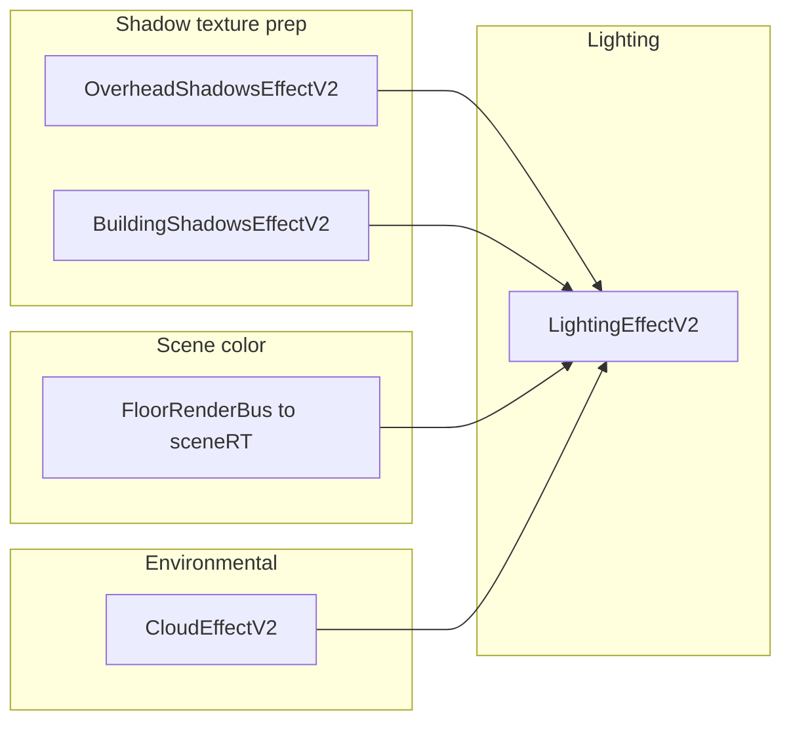

# Lighting and shadows — multi-floor rethink (research)

## Status (last update)

- **2026-03-27:** Initial research write-up: **current V2 lighting pipeline** (this document). Further sections (goals, gap analysis, target architecture, validation) are outlined at the end and remain to be filled in as the rethink proceeds.
- **2026-03-27 (later):** Added **BuildingShadowsEffectV2** and **OverheadShadowsEffectV2** research (outputs, multi-floor policy, passes, and plan-doc divergence note).
- **2026-03-27 (later):** Added **§10 — full shadow producer/consumer registry** (codebase grep): effects, particles, diagnostics, tile flags, and non-scene “shadow” strings excluded or footnoted.
- **Rethink scope note:** **Darkness punch** (compose shader path using `uDarknessPunchGain` / local light term to reduce darkness) is **not** a target for repair or redesign — reported broken long-term; treat as historical documentation only in §3.3 unless product reprioritizes.

---

## 1. Where lighting sits in the frame

V2 rendering is orchestrated by [`FloorCompositor.js`](../../scripts/compositor-v2/FloorCompositor.js). Within one frame, stages that matter for lighting and shadow **textures** run in this order:

1. **Overhead shadow capture** — `OverheadShadowsEffectV2.render` (uses `FloorRenderBus` scene for roof/caster passes).
2. **Building shadow bake/display** — `BuildingShadowsEffectV2.render` (mask-driven directional shadow into a factor texture).
3. **Bus → `sceneRT`** — albedo + tile overlays (specular, fire, etc.); optional floor depth blur path.
4. **Cloud** — `CloudEffectV2.render` (procedural clouds + shadow factor RTs, blocker pass against current bus visibility).
5. **Lighting** — `LightingEffectV2.render` reads `sceneRT`, bound shadow/roof/mask textures, and optional window-light scene; writes the first post buffer (`_postA`).

Later passes (sky color, color correction, water, bloom, etc.) consume the lit result.



**Note:** Overhead and building shadow passes execute **before** the bus draws albedo into `sceneRT`, but they output **textures** sampled later in the lighting compose pass. Cloud runs **after** the bus so its blocker pass sees current tile visibility (see comments in `FloorCompositor` around the cloud stage).

---

## 2. LightingEffectV2 — responsibilities

Implementation: [`scripts/compositor-v2/effects/LightingEffectV2.js`](../../scripts/compositor-v2/effects/LightingEffectV2.js).

### 2.1 Foundry light replication

- **Positive lights:** Each Foundry ambient light document becomes a [`ThreeLightSource`](../../scripts/effects/ThreeLightSource.js) mesh in `_lightScene`, rendered into **`_lightRT`** (half-float, linear, additive accumulation).
- **Negative / darkness lights:** Documents with `negative` / `config.negative` become [`ThreeDarknessSource`](../../scripts/effects/ThreeDarknessSource.js) meshes in `_darknessScene`, rendered into **`_darknessRT`** (byte, linear-stored scalar mask).
- **Scene flags:** Optional per-light tuning from `map-shine-advanced` scene flags (`lightEnhancements`) is merged in `_mergeLightEnhancementsIntoDoc` before constructing sources.
- **CRUD:** Hooks on `createAmbientLight`, `updateAmbientLight`, `deleteAmbientLight`, and `updateScene` (for flag changes) keep the maps in sync.

### 2.2 Levels / perspective visibility

Each frame, `_refreshLightsForLevelsPerspective` sets `mesh.visible` from `isLightVisibleForPerspective(doc)` (see [`elevation-context.js`](../../scripts/foundry/elevation-context.js)), using live `canvas.scene.lights` documents when available. This is **orthogonal** to the compose-time roof/ceiling masks: Levels hides entire light meshes; the compose shader gates **accumulated** light by screen-space / scene-UV masks.

### 2.3 Window light

- A separate **`_windowLightRT`** is cleared and the optional `windowLightScene` is rendered into it (pass 1b in `render`).
- In the compose shader, **Foundry lights** (`tLightSources`) and **window glow** (`tLightWindow`) can use **different** roof-occlusion weights via `uApplyRoofOcclusionToSources` vs `uApplyRoofOcclusionToWindow` (multi-floor defaults set these differently — see §3).

### 2.4 Render targets and compose

| Target        | Role |
|---------------|------|
| `_lightRT`    | Additive Foundry light contribution (HDR half-float). |
| `_windowLightRT` | Additive window emissive pass. |
| `_darknessRT` | Darkness mesh mask (R channel used in compose). |
| Output        | User-supplied `outputRT` (typically `_postA`). |

The compose pass is a fullscreen quad with an embedded GLSL shader (`this._composeMaterial`). It samples **`tScene`** (the bus albedo RT), the three accumulation textures, then applies time-of-day ambient, darkness handling (including punch — see §3.3 caveat), environmental shadows, roof gating, and a coloration term.

---

## 3. Compose shader — how light and shadow combine

The authoritative logic is in the `fragmentShader` string inside `LightingEffectV2` (uniform bindings are set in `render()` immediately before `renderer.render(this._composeScene, …)`).

### 3.1 Core terms

1. **`baseColor`** — `texture2D(tScene, vUv)` (albedo + non-lighting overlays).
2. **`srcLights` / `winLights`** — from `tLightSources` / `tLightWindow`.
3. **`darknessMask`** — from `tDarkness.r`.
4. **`ambient`** — mix of `uAmbientBrightest` and `uAmbientDarkness` by `uDarknessLevel` (Foundry / time-of-day), scaled by `uGlobalIllumination`.
5. **`directLight`** — scalar magnitude from combined lights × `uLightIntensity` (see shader: `lightI` from max channel of gated lights).

### 3.2 Roof / ceiling gating of dynamic lights (not environmental shadow)

Before building `directLight`, the shader computes **`roofLightVisibility`** (0 = blocked, 1 = full):

- **Preferred path:** Half-res **`tCeilingLightTransmittance`** (from `OverheadShadowsEffectV2`) — R channel is treated as transmittance **T**; `stampedVis = T`.
- **Fallback:** Derive visibility from **`tOverheadRoofAlpha`** and **`tOverheadRoofBlock`** with smoothstep thresholds; hard block is multiplied by a **live** roof visibility weight so hover-reveal does not leave a stuck mask (shader comments reference this invariant).

If **`tOutdoorsForRoofLight`** is bound, additional **indoor relief**, **porch lift**, and **interior under hang** terms adjust `roofLightVisibility` using **scene UV** (reconstructed from viewport frustum corners → Foundry scene rect, same basis as building shadow sampling). This is intentionally heuristic (albedo brightness, `step` on outdoors mask, `revealWeight` from live roof alpha).

**Multi-floor scaling (CPU, each frame):**

- `uApplyRoofOcclusionToSources` — scales how much roof gating applies to **Foundry** lights.
- `uApplyRoofOcclusionToWindow` — same for window RT (often `0` when restricting roof gate to top floor only).
- `uApplyRoofOcclusionToBuilding` — scales **building-shadow suppression** where roof alpha carves out shadow (see §3.4).

When `restrictRoofScreenLightOcclusionToTopFloor` is true (default) and the scene has multiple floors with the camera on a **lower** floor, **`roofScreenOcclusionScale`** is set to **0** so roof-based occlusion of sources/building shadow is disabled on that view — avoiding upper-floor ceiling stamps suppressing downstairs lights and building shadows. **Ceiling transmittance** remains available; the product `occlusionWeight * roofScreenOcclusionScale` only scales the **screen-roof** path contribution to `uApplyRoofOcclusionToSources` (transmission params can reduce `occlusionWeight`).

Relevant snippet (CPU side):

```1116:1139:scripts/compositor-v2/effects/LightingEffectV2.js
      const activeFloor = window.MapShine?.floorStack?.getActiveFloor?.();
      const floors = window.MapShine?.floorStack?.getFloors?.() ?? [];
      const topFloorIndex = Math.max(0, Number(floors.length) - 1);
      const fi = typeof activeFloor?.index === 'number' && Number.isFinite(activeFloor.index)
        ? activeFloor.index
        : 0;
      const cu0 = this._composeMaterial.uniforms;
      const transmissionEnabled = this.params.upperFloorTransmissionEnabled === true;
      const rawTransmission = Number(this.params.upperFloorTransmissionStrength);
      const transmission = transmissionEnabled && Number.isFinite(rawTransmission)
        ? Math.max(0, Math.min(1, rawTransmission))
        : 0;
      const occlusionWeight = 1.0 - transmission;
      const restrictRoofToTop = this.params.restrictRoofScreenLightOcclusionToTopFloor === true;
      const lowerFloorMulti = floors.length > 1 && fi < topFloorIndex;
      // 0f7b217: on lower floors of multi-floor scenes, screen-space roof alpha must not
      // suppress building shadows or gate Foundry lights (upper roof still in tOverheadRoofAlpha).
      const roofScreenOcclusionScale = (lowerFloorMulti && restrictRoofToTop) ? 0.0 : 1.0;
      cu0.uApplyRoofOcclusionToSources.value = occlusionWeight * roofScreenOcclusionScale;
      // Window overlays: floor-isolated elsewhere; compose-level roof gating off (0f7b217).
      cu0.uApplyRoofOcclusionToWindow.value = 0.0;
      cu0.uApplyRoofOcclusionToBuilding.value = roofScreenOcclusionScale;
```

### 3.3 Darkness punch (documented only — not a redesign target)

The shader applies an exponential **`punch`** term that is *intended* to lower `localDarknessLevel` and the darkness mesh **`punchedMask`** when local light is strong (`uDarknessPunchGain`, `uNegativeDarknessStrength`). **Product note:** this path has been **non-functional or unreliable for a long time**; any future lighting/shadow architecture should **assume punch is absent** and must **not** rely on fixing punch to deliver “torches beat darkness.” A coordinated Levels-aware darkness + occlusion model should address that need explicitly if still desired.

### 3.4 Environmental shadows — “ambient only, lights punch through”

After forming **`totalIllumination = ambientAfterDark + directLight`**:

1. **Cloud shadow** — If `uHasCloudShadow`, sample `tCloudShadow` at **screen UV** `vUv`. Multiply **only** the ambient portion; re-add `directLight` unchanged. Optional **`tCloudShadowRaw`** mixed by **roof alpha** so rooftops can still show moving cloud shadow when the masked outdoors version would remove it.

2. **Building shadow** — If `uHasBuildingShadow`, sample `tBuildingShadow` at **`sceneUvFoundry`** (world-stable scene rect UV). Mix toward shadow by `uBuildingShadowOpacity`. **Suppress** that darkening where **`tOverheadRoofAlpha`** is high, scaled by `uApplyRoofOcclusionToBuilding`. Again, apply the factor only to **`totalIllumination - directLight`**, then add `directLight` back.

3. **Overhead shadow** — If `uHasOverheadShadow`, sample `tOverheadShadow` at **screen UV**; RGB × alpha encodes combined factor; mix by `uOverheadShadowOpacity`; multiply **ambient component only**, preserve `directLight`.

Uniform comments in code explicitly document the intent:

```376:398:scripts/compositor-v2/effects/LightingEffectV2.js
        // Cloud shadow: factor texture from CloudEffectV2 (1.0=lit, 0.0=shadowed).
        // Multiplies totalIllumination so ambient dims under clouds while dynamic
        // lights (which add on top) still punch through the shadow.
        tCloudShadow:    { value: null },
        ...
        // Building shadow: greyscale factor from BuildingShadowsEffectV2.
        // Applied after cloud shadow — dims only the ambient component.
        tBuildingShadow:     { value: null },
        ...
        // Overhead shadow: per-frame screen-space shadow from OverheadShadowsEffectV2.
        // Sampled directly at vUv (screen-space RT). Dims ambient only.
        tOverheadShadow:     { value: null },
```

### 3.5 Final albedo and coloration

- **`minIllum`** floor prevents pure black.
- **`litColor = baseColor.rgb * totalIllumination`**.
- **Coloration:** additive term `safeLights * master * reflection * uColorationStrength` (tints by perceived albedo brightness). **`safeLights`** is the roof-gated sum of Foundry + window channels (before the scalar `directLight` extraction).

---

## 4. Inputs wired from FloorCompositor into `LightingEffectV2.render`

Call site (abbreviated): `FloorCompositor` passes cloud textures, building shadow factor + opacity, overhead shadow factor, roof alpha/block, outdoors mask for roof-light gate, and ceiling transmittance:

```2222:2230:scripts/compositor-v2/FloorCompositor.js
    const lightingCtx = window.MapShine?.activeLevelContext ?? null;
    const outdoorsForLightingTex = this._resolveOutdoorsMask(lightingCtx, { allowWeatherRoofMap: false }).texture ?? null;
    // IMPORTANT INVARIANT:
    // Keep ceiling transmittance available during hover-reveal; blocker/occlusion
    // fade is handled in shader via roof visibility weights (not by runtime nulling).
    const ceilingTransmittanceTex = (!_disableRoofInLighting && this._overheadShadowEffect?.ceilingTransmittanceTextureForLighting)
      ? this._overheadShadowEffect.ceilingTransmittanceTextureForLighting
      : null;
    this._lightingEffect.render(this.renderer, this.camera, currentInput, this._postA, winScene, cloudShadowTex, cloudShadowRawTex, buildingShadowTex, overheadShadowTex, buildingShadowOpacity, overheadRoofAlphaTex, overheadRoofBlockTex, outdoorsForLightingTex, ceilingTransmittanceTex);
```

**View / scene UV uniforms** for building shadow and outdoors sampling are recomputed each frame from the active camera and `canvas.dimensions` (orthographic frustum corners or perspective ray–ground intersection).

---

## 5. Summary table — what dims what (today)

| Effect / mask              | Sample space   | Affects ambient? | Affects Foundry/window light in compose? |
|---------------------------|----------------|------------------|------------------------------------------|
| Cloud shadow              | Screen UV      | Yes              | No (explicit split in shader)            |
| Building shadow           | Scene UV       | Yes              | No                                       |
| Overhead shadow           | Screen UV      | Yes              | No                                       |
| Roof / ceiling transmittance | Screen UV (T half-res or derived) | Indirectly (reduces `roofLightVisibility` for `srcLights`/`winLights`) | Yes, via `visS` / `visW` |
| Darkness meshes           | Screen UV      | Yes (ambient + mask; punch path exists in code) | Punch **not** trusted for design (see §3.3) |
| Levels `isLightVisibleForPerspective` | N/A (mesh on/off) | Hides whole source if invisible | If visible, mesh still contributes to RT then compose gates |

---

## 6. BuildingShadowsEffectV2 — research

Implementation: [`scripts/compositor-v2/effects/BuildingShadowsEffectV2.js`](../../scripts/compositor-v2/effects/BuildingShadowsEffectV2.js).

### 6.1 Purpose and outputs

- Builds a **directional** “building shadow” field from **`_Outdoors` mask semantics**: indoor (dark) regions act as casters; shadow strength accumulates along a **sun-opposite** direction in **scene / world UV space** (not screen UV), so zoom does not change shadow length in world terms (shader comment: projection distance must not scale with camera zoom).
- **Outputs**
  - **`_strengthTarget`** — intermediate RT: greyscale **strength** after projecting multiple floor masks with **`MaxEquation`** blending (per-texel max across draws).
  - **`shadowTarget`** — final **`shadowFactorTexture`** for lighting: `factor = 1.0 - strength * opacity` (invert pass). Lighting expects **1 = lit, 0 = shadowed** in `.r`.

RT dimensions come from **`_resolveSceneTargetSize`**: prefer the **outdoors mask texture size** from `GpuSceneMaskCompositor` (`getFloorTexture(key, 'outdoors')`), not the drawing buffer — so sampling stays aligned with mask authoring space.

### 6.2 Two-mask model: caster vs receiver

The **project** fragment shader uses:

- **`uOutdoorsMask`** — **caster** samples along the projection kernel (per floor draw).
- **`uReceiverOutdoorsMask`** — **receiver** gate at the **output pixel** `vUv` (active/view floor). Indoor receivers get reduced contribution via `casterIndoor * receiverOutdoorGate` so indoor pixels are not fully crushed by outdoor-projected shadow.

`_resolveReceiverMaskTexture` binds the **active level** outdoors texture (from `activeLevelContext` `bottom:top`, or `floorStack.getActiveFloor()`, else `setOutdoorsMask` fallback).

### 6.3 Multi-floor caster union policy

`render()` loops **`floorKeys` from `_resolveSourceFloorKeys`** and renders the fullscreen project pass **once per key** into `_strengthTarget` with **max blending** — effectively a **per-texel max** of shadow strength across those floors.

**Selection rule (implemented):** For each floor in `floorStack.getFloors()` with `floor.index >= resolvedActiveIdx`, push that floor’s compositor key(s). **Floors below the active index are excluded.** So the union is **active floor + all upper floors**, not “all floors below the camera” and not “active only.”

**Fallback policy:** If `floorCount > 1` and no keys resolve, the effect **refuses** the generic `setOutdoorsMask` fallback (avoids **ground mask leaking onto upper floors**). Single-floor scenes may use `_outdoorsMask` fallback.

**Warmup:** `_maybeWarmFloorMaskCache` can call `compositor.preloadAllFloors` in the background on multi-floor maps so keys have textures ready.

### 6.4 Sun direction

`setSunAngles(azimuthDeg, elevationDeg)` from the compositor drives `uSunDir`; otherwise azimuth is derived from **`weatherController.timeOfDay`** and **`sunLatitude`** param. Direction feeds the **2D projection vector** in mask UV space.

### 6.5 Divergence from older planning text

[`docs/planning/V2-EFFECT-INTEGRATION.md`](V2-EFFECT-INTEGRATION.md) §8.2.2 **recommended “C: union of floors ≤ active”** (all structure at or below the viewed floor). **Shipping code uses the opposite inclusion rule for casters (active + above).** The research track should decide which semantic is correct for “upper floors cascade onto lower floors” vs “silhouette from everything below eye level,” and align docs + implementation.

---

## 7. OverheadShadowsEffectV2 — research

Implementation: [`scripts/compositor-v2/effects/OverheadShadowsEffectV2.js`](../../scripts/compositor-v2/effects/OverheadShadowsEffectV2.js). Integrates with [`FloorRenderBus`](../../scripts/compositor-v2/FloorRenderBus.js) via `beginOverheadShadowCaptureReveal` / `endOverheadShadowCaptureReveal` so **upper-floor overhead tiles** can participate in **caster** passes while the player views a lower floor.

### 7.1 Purpose and texture products

Screen-space **roof-driven** shadow and **lighting occlusion** data:

| Getter / target | Role |
|-----------------|------|
| `shadowFactorTexture` → `shadowTarget` | RGB(A) **overhead shadow factor** for `LightingEffectV2` (sampled at **screen UV**); ambient-only dimming in compose. |
| `roofAlphaTexture` → `roofVisibilityTarget` | **Live** roof/tree visibility (respects hover fade). Used in lighting compose for roof gating, building-shadow suppression, cloud raw mix, etc. |
| `roofBlockTexture` → `roofBlockTarget` | **Forced-opaque** roof pass (no guard-band camera) for **hard** blocker; must stay in **direct screen UV** (comment: do not apply guard remap to `roofVisibilityTarget`). |
| `ceilingTransmittanceTextureForLighting` | Half-res **T** (R channel): packed transmittance from roof vis + block with thresholds aligned to lighting (only valid after `_renderCeilingTransmittancePass` sets `_ceilingTransmittanceWritten`). |
| `fluidRoofTarget`, tile projection/receiver targets | Optional fluid tint, tile-projection shadow, depth-modulated paths (uniforms on `shadowMesh` material). |

### 7.2 Layering and bus interaction

- **ROOF_LAYER (20)** — overhead tiles, upper-floor slabs (`levelRole: floor` / flags per file header).
- **WEATHER_ROOF_LAYER (21)** — tree canopies / weather roof: included in **visibility and blocker** captures; **excluded** from the **roof shadow caster** pass (avoids dark canopy underside regression). Trees get separate uniform overrides for blocker passes vs caster pass.

### 7.3 `render()` pass order (conceptual)

1. **Drawing-buffer-sized** RTs (`onResize` from `getDrawingBufferSize`).
2. **`roofVisibilityTarget`** — camera layers ROOF + WEATHER_ROOF; **live opacity** (fluid overlays excluded). Always updated even if overhead shadow params are disabled, so **WindowLightEffectV2** and others can occlude against visible roofs.
3. If **`params.enabled` is false:** still refresh **roof block** + **ceiling transmittance**, clear shadow factor to white, restore state, **return** (lighting must not sample black).
4. If enabled: **guard-band** expand orthographic camera (not perspective — avoids UV drift) for **caster** captures only.
5. **`beginOverheadShadowCaptureReveal`** on bus — reveal tiles needed for upper-floor casters.
6. **Fluid-only** pass → `fluidRoofTarget` (ROOF_LAYER, fluid visible, solids hidden).
7. **Caster pass** → `roofTarget`: force roof sprites **opaque** (hover UX fade ignored for shadow shape); **force upper overhead casters** via `_forceUpperOverheadCasterVisibilityForRoofPass`; **hide** tree meshes and fluid for this pass; then render ROOF+WEATHER layers.
8. Restore guard camera and **end** bus reveal snapshot.
9. **`roofBlockTarget`** at **unscaled** camera (direct screen UV) for hard blocker; tree uniform overrides for stable capture.
10. **`_renderCeilingTransmittancePass`** — blits roof vis + block → **T** with smoothsteps; hard block **× roofVisOcc** so hover-reveal does not leave stuck light suppression.
11. **Shadow mesh** in **`shadowScene`**: world-pinned mesh (from `setBaseMesh` / `baseMesh`) renders with a large shader that combines roof offset shadow, optional **indoor shadow** from `_Outdoors`, **upper-floor outdoors min** for “outdoor building shadow” casters (up to three textures in `uObUpperOutdoors0..2`), fluid, tile projection, optional **depth texture** (caster-above-receiver heuristic).
12. Output → **`shadowTarget`**.

`update()` feeds sun direction, receiver **outdoors** mask (active floor only — “keeps overhead / building contributions from leaking into current-level indoor”), upper-floor outdoors textures for outdoor-building-shadow casters, and related uniforms.

### 7.4 Relationship to building shadows and lighting

- **Building shadow** = scene UV, mask ray/accumulation from **outdoors composites** (active+upper keys).
- **Overhead shadow** = screen UV, **geometry** from bus roof layers + optional mask-driven indoor/outdoor splits inside the shadow mesh shader.
- **Lighting** combines both on **ambient only**; **roof alpha** on screen can **lift** building shadow (`uApplyRoofOcclusionToBuilding`) where rooftops are visible.

### 7.5 Complexity / reliability notes (for rethink)

- Many **temporary visibility, layer, and uniform overrides** during capture; ordering with `FloorRenderBus` reveal is load-bearing (comments warn caster vs blocker paths must not be conflated).
- **Guard-band** vs **non-guard** split exists specifically because **lighting samples roof visibility in raw screen UV** — any future “unified occlusion” field must preserve this invariant or re-derive UVs consistently.

---

## 8. Implications for the rethink (stub)

This section is intentionally brief until follow-up research rounds.

- **“Lights overcome shadows”** is **partially** implemented: cloud, building, and overhead shadows in compose **only scale the ambient portion**; Foundry lights are added back as `directLight`. Roof gating **does** scale the light buffers (`safeLights`), so occlusion of lights is **not** purely “environment vs direct” — it is split across RT generation (mesh visibility) and compose (roof/ceiling).
- **Multi-floor reliability** currently relies on **disabling** screen-space roof occlusion on lower floors (`restrictRoofScreenLightOcclusionToTopFloor`) rather than a single height-aware occlusion field.
- **Building vs overhead** use **different UV spaces** (scene vs screen), which is correct for world-stable sun shadow vs screen-space roof stamp but increases the chance of inconsistent behavior at floor boundaries unless both are driven by the same semantic “receiver” model.

---

## 9. Next sections to add (roadmap)

- Executive summary and success criteria (occlusion accuracy, cascade, light/shadow contract).
- Formal requirement list (from project plan).
- Target architecture options and validation scenarios.
- **Levels-aware coordination:** single per-frame “lighting perspective” contract (receiver floor, caster policy, transmittance semantics) feeding producers/consumers — see Cursor plan **Part G**.
- Any **new** shadow or occlusion output must be reconciled against **§10** (update producers/consumers and HealthEvaluator / breaker-box if applicable).

---

## 10. Shadow producers, consumers, and wiring (registry)

Repo-wide search targets: `shadow`, `Shadow`, `cloudShadow`, `buildingShadow`, `overheadShadow`, `worldShadow`, `shadowFactor`, `CLOUD_SHADOW_BLOCKER`, roof alpha/block transmittance used for occlusion. **Excluded from “scene lighting” scope:** CSS `box-shadow` in UI (`control-panel-manager.js`, etc.) and purely decorative strings.

### 10.1 Producers (create shadow or occlusion textures)

| System | Outputs / role |
|--------|----------------|
| [`CloudEffectV2.js`](../../scripts/compositor-v2/effects/CloudEffectV2.js) | **`cloudShadowTexture`** (lit factor), **`cloudShadowRawTexture`**, procedural field; **blocker** pass using bus sprites (`userData.cloudShadowBlocker`, layer rules in comments). |
| [`BuildingShadowsEffectV2.js`](../../scripts/compositor-v2/effects/BuildingShadowsEffectV2.js) | **`shadowFactorTexture`** — scene-UV building shadow factor (see §6). |
| [`OverheadShadowsEffectV2.js`](../../scripts/compositor-v2/effects/OverheadShadowsEffectV2.js) | **`shadowFactorTexture`**, **`roofAlphaTexture`** (visibility), **`roofBlockTexture`**, **`ceilingTransmittanceTextureForLighting`**, plus internal caster RTs (fluid, tile projection, etc.). |

### 10.2 Primary hub: [`FloorCompositor.js`](../../scripts/compositor-v2/FloorCompositor.js)

- Runs overhead then building shadow passes; later cloud; binds **cloud / building / overhead** shadow textures into **`LightingEffectV2.render`**.
- Passes the same cloud / building / overhead shadow textures into **`WaterEffectV2`** (`setCloudShadowTexture`, `setBuildingShadowTexture`, `setOverheadShadowTexture`).
- Passes cloud + view bounds into **`WindowLightEffectV2`** (`setCloudShadowTexture`).
- Passes **`roofAlphaTexture`** into **`SkyColorEffectV2`** and window light (roof occlusion for those passes).

### 10.3 Consumers (sample shadow/occlusion data for rendering or logic)

| Consumer | What it uses | Notes |
|----------|----------------|-------|
| [`LightingEffectV2.js`](../../scripts/compositor-v2/effects/LightingEffectV2.js) | Cloud, building, overhead shadow factors; roof alpha/block; ceiling **T**; outdoors for roof-light relief | Main compose (§3–§4). Params **`lightningOutsideShadow*`** exist in the control schema; no additional string hits in other modules — likely consumed inside light/shader path via merged config (verify when changing lightning behavior). |
| [`WaterEffectV2.js`](../../scripts/compositor-v2/effects/WaterEffectV2.js) + [`water-shader.js`](../../scripts/compositor-v2/effects/water-shader.js) | **`tCloudShadow`**, **`tBuildingShadow`** (scene UV), **`tOverheadShadow`** (screen UV) | Combines **structural** shadow (max of building vs overhead) for specular/foam; cloud shadow including **caustics kill** path; floating-foam uses a **procedural** sun-offset “shadow” (not the building RT). |
| [`SpecularEffectV2.js`](../../scripts/compositor-v2/effects/SpecularEffectV2.js) + [`specular-shader.js`](../../scripts/compositor-v2/effects/specular-shader.js) | **Cloud** shadow map, **building** shadow map (`shadowFactorTexture` / V1 `worldShadowTarget`) | **Building shadow suppression** on specular highlights (`buildingShadowSuppression*` params). |
| [`WindowLightEffectV2.js`](../../scripts/compositor-v2/effects/WindowLightEffectV2.js) | **`setCloudShadowTexture`** + contrast/bias/gamma uniforms | Screen-space cloud shadow on window glow. |
| [`DistortionManager.js`](../../scripts/compositor-v2/effects/DistortionManager.js) | Cloud shadow via **`texture-manager`** / fallback `CloudEffect` RT | Water/refraction path: **cloudShadowCausticsKill** logic in embedded shader; samples `cloudShadow.screen`. |
| [`SkyColorEffectV2.js`](../../scripts/compositor-v2/effects/SkyColorEffectV2.js) | **`tOverheadRoofAlpha`** | Roof-aware grading (occlusion of sky tint), not the same as building shadow factor. |
| [`PrismEffectV2.js`](../../scripts/compositor-v2/effects/PrismEffectV2.js) | **`_overheadShadowEffect.roofAlphaTexture`** | Roof-aware prism / refraction context. |
| [`IridescenceEffectV2.js`](../../scripts/compositor-v2/effects/IridescenceEffectV2.js) | **`roofAlphaTexture`** | Same pattern as Prism. |
| [`WeatherParticles.js`](../../scripts/particles/WeatherParticles.js) | **`roofAlphaTexture`**, **`roofBlockTexture`**, weather roof fallbacks | Rain/precip and roof interaction; large uniform surface for **`uRoofAlphaMap`**. |
| [`RoofDripGpuSilhouetteReadback.js`](../../scripts/particles/RoofDripGpuSilhouetteReadback.js) | **`roofAlphaTexture`** argument | GPU readback / silhouette against roof mask. |

### 10.4 Data / authoring / diagnostics (not full-screen effects)

| Area | Role |
|------|------|
| [`tile-manager.js`](../../scripts/scene/tile-manager.js) + [`module.js`](../../scripts/module.js) | Tile flag **`cloudShadowsEnabled`** → toggles **`TILE_FEATURE_LAYERS.CLOUD_SHADOW_BLOCKER`** ([`render-layers.js`](../../scripts/core/render-layers.js)) so tiles participate in cloud shadow occlusion. |
| [`tweakpane-manager.js`](../../scripts/ui/tweakpane-manager.js) | Surfaces shadow-related tile flags; health-style checks for **cloud shadow blocker** layer vs flag. |
| [`RenderStackSnapshotService.js`](../../scripts/core/diagnostics/RenderStackSnapshotService.js) | Registers **overhead / building / cloud** shadow passes for stack snapshots. |
| [`diagnostic-center-dialog.js`](../../scripts/ui/diagnostic-center-dialog.js) | Inspects lighting uniforms (`tBuildingShadow`, `tOverheadShadow`, cloud wiring, sizes). |
| [`HealthEvaluatorService.js`](../../scripts/core/diagnostics/HealthEvaluatorService.js) | **Dependency edges:** `CloudEffectV2`, `OverheadShadowsEffectV2`, `BuildingShadowsEffectV2` → `LightingEffectV2`; contract checks on shadow RTs. |
| [`breaker-box-dialog.js`](../../scripts/ui/breaker-box-dialog.js) | Breaker entries for cloud field / building shadow RT keywords. |
| [`texture-manager.js`](../../scripts/ui/texture-manager.js) | Labels **`cloudShadow.screen`** / **`cloudShadowRaw.screen`** for debug. |

### 10.5 Related references (sun alignment, not shadow maps)

| File | Note |
|------|------|
| [`BushEffectV2.js`](../../scripts/compositor-v2/effects/BushEffectV2.js) | Reads **`_overheadShadowEffect.params.sunLatitude`** (and sky azimuth) to align **`uSunDir`** with other effects — **not** sampling shadow textures. |

### 10.6 Rethink checklist

When changing shadow format (UV space, factor meaning, RT count, or merge passes):

1. Update **producers** (§10.1) and **`FloorCompositor`** bindings (§10.2).
2. Update **every consumer** in §10.3 (water and specular duplicate building/cloud/overhead logic in shaders — easy to desync from lighting).
3. Update **particles** (weather, roof drip) if roof alpha/block semantics move.
4. Refresh **HealthEvaluator** contracts, **breaker-box** hints, **diagnostic center**, and **RenderStackSnapshot** metadata.
5. Re-verify **tile** `cloudShadowsEnabled` ↔ **CLOUD_SHADOW_BLOCKER** behavior against any new cloud-occlusion path.

---

## References (code)

- **§10** — extended list of shadow-related modules (water, specular, window light, weather particles, diagnostics, tile flags).
- [`scripts/compositor-v2/FloorCompositor.js`](../../scripts/compositor-v2/FloorCompositor.js) — frame stages and `lightingEffect.render` wiring.
- [`scripts/compositor-v2/effects/LightingEffectV2.js`](../../scripts/compositor-v2/effects/LightingEffectV2.js) — passes, uniforms, compose shader.
- [`scripts/compositor-v2/effects/BuildingShadowsEffectV2.js`](../../scripts/compositor-v2/effects/BuildingShadowsEffectV2.js) — scene-space mask projection, multi-floor max blend, invert factor.
- [`scripts/compositor-v2/effects/OverheadShadowsEffectV2.js`](../../scripts/compositor-v2/effects/OverheadShadowsEffectV2.js) — roof captures, ceiling transmittance, shadow mesh, bus reveal.
- [`scripts/compositor-v2/FloorRenderBus.js`](../../scripts/compositor-v2/FloorRenderBus.js) — overhead shadow capture reveal API.
- [`scripts/effects/ThreeLightSource.js`](../../scripts/effects/ThreeLightSource.js) — Foundry light mesh behavior.
- [`scripts/foundry/elevation-context.js`](../../scripts/foundry/elevation-context.js) — `isLightVisibleForPerspective`.
- [`docs/planning/V2-EFFECT-INTEGRATION.md`](V2-EFFECT-INTEGRATION.md) — §8.2 historical multi-floor shadow analysis (differs from current building-shadow key policy).
